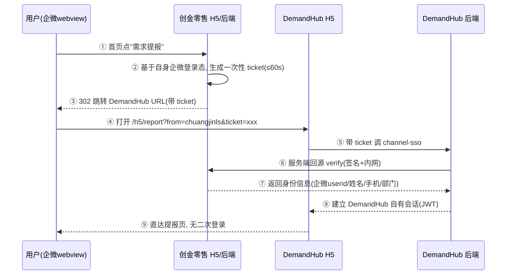

# DemandHub H5 嵌入 "创金零售" 企微应用・技术方案与对接标准 v2.0


| 项目   | 内容                                                                  |
| ---- | ------------------------------------------------------------------- |
| 文档名称 | DemandHub H5 嵌入创金零售技术方案与对接标准                                        |
| 版本   | v2.1（v2.0 细化：明确 URL 不得携带身份字段，用户名 / 企微 ID 仅经 verify 响应返回；补充渠道来源落库链路） |
| 提出方  | 财管科技产品部（DemandHub 团队）                                               |
| 接收方  | 创金零售系统团队                                                            |
| 日期   | 2026-09-22                                                          |
| 对接方式 | 企微 webview 内路由跳转（非 iframe）+ 一次性 SSO 票据 + 服务端回源校验                    |


***

## 1. 对接目标

在 "创金零售" 企微应用首页功能区新增 "需求提报" 入口，用户点击后在企微内置浏览器中打开 DemandHub H5 提报页，**沿用创金零售已有的企微登录态，无需二次登录**，实现零售一线手机端一键提报需求。

### 1.1 为什么不用 iframe

企微 webview 对 iframe 的登录态共享、JS 能力、高度自适应支持不稳定，一期采用路由跳转，体验为 "从创金零售跳到 DemandHub 提报页"，左上角一键返回。

### 1.2 为什么不共享企微应用 secret（重要）

v1.0 曾设想 DemandHub 注册独立应用或借用创金零售应用 secret 自行调企微 OAuth，评估后放弃：


* 创金零售是已投产系统，其应用 secret 跨系统共享违反密钥最小暴露原则，重置 / 泄露会互相影响生产；

* 同一 secret 双方分别刷新 access\_token 会互相踢失效；

* 创金零售团队需要改生产应用可信域名等配置，迭代受制于人。

改为**创金零售利用自身登录态签发一次性票据、DemandHub 回源校验**的渠道 SSO 模式，对创金零售的增量仅为：一个入口跳转 + 一个内部校验接口。

### 1.3 创金零售侧不需要担心的事


* 不需要把应用 secret 交给 DemandHub；

* 不需要改可信域名、不需要在企微后台为 DemandHub 做任何配置；

* 不需要做前端组件合并、不改用户体系；

* 不需要把用户密码等任何凭证交给 DemandHub。

## 2. 整体流程




**信任链**：DemandHub 只信任经签名、回源校验确认的身份；**绝不**直接信任 URL 上明文传递的 userid / 姓名。

## 3. 对接标准（创金零售侧需实现）

### 3.1 入口与跳转


* 位置：创金零售首页功能区宫格，"需求提报" 卡片（建议前 4 个高频入口之一，NEW 角标）。

* 点击行为：**由创金零售后端签发 ticket 后 302** 到下述 URL（不要用写死参数的前端静态链接，ticket 必须实时生成）：


```
https://{demandhub-h5域名}/h5/report?from=chuangjinls\&ticket={ticket}\&state={random}
```


| 参数     | 必填 | 说明                                   |
| ------ | -- | ------------------------------------ |
| from   | 是  | 固定 `chuangjinls`，DemandHub 据此呈现嵌入态外壳 |
| ticket | 是  | 一次性登录票据，规则见 3.2                      |
| state  | 建议 | 随机串，DemandHub 原样忽略 / 校验，辅助链路追踪       |


* 跳转需保证在企微内置浏览器当前 webview 打开（`window.location.assign` / 302 均可）。

> **URL 上只允许出现&#x20;**
>
> `from`
>
> **&#x20;/&#x20;**
>
> `ticket`
>
> **&#x20;/&#x20;**
>
> `state`
>
> **，不要拼接用户名、企微 userid、手机号、部门等任何身份字段。**
>
>  URL 参数可被看到和篡改，DemandHub 对 URL 上的明文身份
>
> **一律不读取、不采信**
>
> ；用户名（name）、企微 ID（user_id）等身份信息统一由 DemandHub 后端持 ticket 调用 3.3 的 verify 接口、在
>
> **服务端响应体**
>
> 中获取。ticket 一次性、≤60s 且与登录用户绑定，等同于 "加密取件凭证"，即使被截取也无法复用。

### 3.2 ticket 规则


| 项   | 要求                                                             |
| --- | -------------------------------------------------------------- |
| 形态  | 推荐不透明随机串（≥32 字节，密码学随机），存创金零售 Redis；如用 JWT 需双方另行确认验签密钥轮换机制      |
| 有效期 | ≤ 60 秒                                                         |
| 次数  | **一次性**：verify 成功后立即作废；重复校验返回 40002                            |
| 绑定  | 与当前登录用户、目标系统（DemandHub）绑定，不可跨系统复用                              |
| 传输  | URL 传输全程 HTTPS；DemandHub 登录成功后立即从浏览器地址栏清除 ticket（replaceState） |

### 3.3 票据校验接口（创金零售提供）


```
POST {ls\_base\_url}/openapi/demandhub/sso/verify

Content-Type: application/json
```

**请求头（服务间鉴权）**


| Header      | 说明                                       |
| ----------- | ---------------------------------------- |
| X-App-Key   | 分配给 DemandHub 的调用方标识（按环境独立）              |
| X-Timestamp | 毫秒时间戳，与服务端偏差 ≤ 5 分钟                      |
| X-Nonce     | 随机串，5 分钟内不可重复（防重放）                       |
| X-Sign      | HMAC-SHA256 (app\_secret, 待签名字符串)，十六进制小写 |

待签名字符串（DemandHub 侧严格按此实现，如有不同以双方冻结的接口文档为准）：


```
POST\n{path}\n{X-App-Key}\n{X-Timestamp}\n{X-Nonce}\n{body 原文}
```

其中 `{path}` 为不含域名的接口路径（如 `/openapi/demandhub/sso/verify`），`{body}` 为请求体原文。

**请求体**


```
{ "ticket": "9f3c...b21" }
```

**成功响应（HTTP 200）**


```
{

&#x20; "errcode": 0,

&#x20; "errmsg": "ok",

&#x20; "user": {

&#x20;   "user\_id": "liuquan",

&#x20;   "name": "刘泉",

&#x20;   "phone": "138\*\*\*\*0000",

&#x20;   "dept\_id": "110",

&#x20;   "dept\_name": "财管科技产品部",

&#x20;   "dept\_path": "创金合信零售业务线/财管科技产品部",

&#x20;   "employee\_no": "E10086",

&#x20;   "email": "liuquan@example.com"

&#x20; },

&#x20; "ticket\_expire\_at": 1789000000000

}
```

**身份字段要求**


| 字段                      | 必填    | 用途                                                                              |
| ----------------------- | ----- | ------------------------------------------------------------------------------- |
| user\_id                | **是** | 渠道侧稳定唯一 ID。**请直接返回企业微信 userid**（企业内永久不变），作为 DemandHub 自动匹配 / 建号的主键；不要用会变的手机号或姓名 |
| name                    | **是** | 自动建号姓名                                                                          |
| phone | 选填 | 辅助匹配与同人工号体系打通；如受权限限制可空，DemandHub 按 user_id 建号，不阻塞提报 |
| dept_id | 选填 | 企微部门 ID，与 DemandHub 组织树映射；缺失时挂“未分配组织”，不阻塞登录提报 |
| dept_name / dept_path | 选填 | 部门未映射时辅助校准 |
| employee_no / email | 选填 | 后续打通工号 / 通知用 |

> **必填仅 user_id（企微 ID）与 name；手机号、部门、工号、邮箱均为选填**，如受敏感信息权限限制拿不到则留空，**不阻塞登录与提报**；DemandHub 一律以 user_id（企微 userid）为建号与匹配主键，匹配优先级：企微 userid > 手机号。

**错误响应**


| errcode | 含义           | DemandHub 行为                    |
| ------- | ------------ | ------------------------------- |
| 0       | 成功           | 建立会话                            |
| 40001   | ticket 无效或过期 | 展示 "登录已失效，请从创金零售重新进入"，引导返回      |
| 40002   | ticket 已被使用  | 同上（防重放）                         |
| 40003   | 签名 / 鉴权失败    | 记录告警，展示服务异常提示（不暴露细节）            |
| 40004   | 用户已离职 / 停用   | 展示 "账号不可用，请联系管理员"               |
| 40005   | 参数缺失         | 记录告警，提示重新进入                     |
| 500xx   | 创金零售服务异常     | 3s 超时、快速失败，展示 "登录服务暂时不可用，请稍后重试" |

> 字段名 / 错误码如与创金零售开放平台既有规范冲突，可沿用贵司规范，但需在契约冻结时提供完整字段映射表。

### 3.4 网络与密钥


* verify 接口**无需公网发布**：双方服务器走公司内网 / 专线，互加 IP 白名单；

* 每个环境（测试 / 生产）独立 app\_key、app\_secret；

* app\_secret 只在服务端保存，不经过前端、不进日志、不入代码仓库；

* 建议密钥每年轮换，双方提前 5 个工作日同步；

* DemandHub 调用超时 3s、失败不做无限重试（票据仅 60s 有效，重试无意义），直接降级提示。

### 3.5 （二期可选）状态通知代发接口

DemandHub 一期只做站内信。若后续希望在企微里收到 "已受理 / 已完成" 应用消息，因 DemandHub 无独立企微应用，可由创金零售代发，建议预留：


```
POST {ls\_base\_url}/openapi/demandhub/notify/send

请求体：{ "user\_id":"liuquan", "template\_code":"DEMAND\_ACCEPTED",

&#x20;        "title":"需求已受理", "content":"...", "url":"https://{dh}/h5/detail/123" }
```

本期**不阻塞、不验收**，仅请创金零售评估可行性。

## 4. DemandHub 侧承诺

### 4.1 H5 页面与视觉


* 入口 URL：`https://{demandhub-h5域名}/h5/report?from=chuangjinls`（ticket 由贵司跳转时追加）；

* 390–430px 手机宽自适应，触控友好；

* 主色 #1F3A8A、白色圆角卡片、深蓝头部，视觉对齐创金零售（落地前与贵司设计确认最新色值 / 头部高度，以原型 v1.0 为基准）。

### 4.2 登录态与会话


* 收到 ticket 后由 DemandHub 后端回源 verify，通过后签发 DemandHub 自有 JWT（access 2h、refresh 8h，无感续期）；

* 同一员工多次进入自动识别为同一用户（按企微 userid > 手机号匹配 OneID）；

* 首次进入的在职员工**自动开通**（verify 返回必填 user_id、name 即视为贵司在职人员），无需管理员预先建号，可立即提报；手机/部门等选填字段缺失不阻塞，仅在管理员后台标记“资料待补全”；缺必填 user_id/name 按 40005 拒绝登录。

### 4.3 返回与嵌入态


* `from=chuangjinls` 时隐藏 DemandHub 自身底部导航，仅保留左上角返回，点击 `history.back()` 回到创金零售；

* 不使用 JS-SDK（不依赖 wx.config），拍照 / 附件用 H5 原生能力实现。

### 4.4 数据落库


* 该渠道用户提交的需求，DemandHub 后台来源标识为 "创金零售"（渠道码 CHUANGJIN\_LS），可单独筛选、统计；

* 渠道识别以后端会话为准：verify 通过后渠道码写入 DemandHub 自有 JWT，后续每次请求由网关注入服务端上下文，**不接受前端 / URL 传入渠道参数**，前端无法伪造渠道；

* 身份字段同样只取自 verify 响应：`user_id`（企微 ID）落渠道映射并回填 `wecom_userid`，`name` 落 OneID 姓名，`dept_id` 按 DemandHub 维护的部门对照表映射组织。

### 4.5 PC 管理端


* DemandHub PC 管理端在浏览器独立访问，账号密码登录，**不需要创金零售做任何对接**；

* 一线员工只用 H5，不需要 PC 账号。

### 4.6 兼容性


* 适配企微内置浏览器（Chromium 内核），iOS / 安卓企微客户端最新两个大版本；

* 全链路 HTTPS。

### 4.7 故障降级


| 场景                   | 用户看到                         |
| -------------------- | ---------------------------- |
| 直接访问（无 ticket、非授权入口） | "请从创金零售『需求提报』入口进入" 提示页       |
| ticket 过期 / 重放       | "登录已失效，请返回重新进入"              |
| verify 服务不可用         | "登录服务暂时不可用，请稍后重试"，不放行任何未核验身份 |
| 离职 / 停用              | "账号不可用，请联系 DemandHub 管理员"    |

## 5. 联调与里程碑

### 5.1 双方交付物与时间点


| 事项                               | 负责方              | 到位时间（建议）           |
| -------------------------------- | ---------------- | ------------------ |
| 对接标准评审、字段 / 签名 / 错误码契约冻结         | 双方               | P0 结束前（开发启动第 1 周内） |
| Mock 接口样例（DemandHub 可先提供模拟服务契约）  | DemandHub        | P0                 |
| 测试环境 verify 接口 + 测试入口            | 创金零售             | 不晚于 P5 结束（约第 3 周中） |
| DemandHub 测试环境 H5 地址、app\_key 发放 | DemandHub        | P6 前               |
| 真机联调窗口（iOS / 安卓）                 | 双方               | P6（约第 4 周）         |
| 生产入口发布、生产密钥交换                    | 创金零售 + DemandHub | P7 上线窗口            |

### 5.2 联调步骤


1. 契约冻结后，DemandHub 按 Mock 并行开发，不阻塞贵司排期；

2. 贵司测试环境就绪后，提供 verify 测试地址、app\_key/secret、测试成员名单；

3. 在创金零售**测试企业 / 测试环境**首页加入口，真机验证全链路；

4. 按 5.3 逐项验收签字；

5. 生产发布：贵司入口随发布窗口上线，DemandHub 灰度开放。

### 5.3 验收标准（AC）


| 编号    | 验收项  | 通过标准                                          |
| ----- | ---- | --------------------------------------------- |
| AC-01 | 入口可见 | 创金零售首页功能区显示 "需求提报" 图标与名称                      |
| AC-02 | 跳转性能 | 点击后 ≤ 2 秒打开 DemandHub H5（弱网 ≤ 4s 出首屏骨架）       |
| AC-03 | 免登   | 企微内点击入口无任何登录页 / 授权弹窗，直达提报表单；同一人多次进入为同一账号      |
| AC-04 | 视觉对齐 | 390–430px 排版正常，风格与创金零售一致                      |
| AC-05 | 返回   | 左上角返回回到创金零售首页                                 |
| AC-06 | 提报成功 | 提交后 DemandHub 后台可见，来源标识 "创金零售"；iOS / 安卓各通过一遍  |
| AC-07 | 异常态  | 过期 ticket、重放、直接访问、verify 停机、离职账号均有明确提示且无法绕过登录 |
| AC-08 | 安全   | 签名错误 / 时间戳过期 /nonce 重复被拒；明文伪造身份 URL 无法登录      |

## 6. 联系与协作


| 事项           | 对接人                     |
| ------------ | ----------------------- |
| 业务 / 入口设计    | 财管科技产品部 刘泉 / 创金零售产品与设计  |
| 接口与联调        | DemandHub 开发 / 创金零售后端开发 |
| 网络 / 密钥 / 发布 | 双方运维                    |

## 7. 版本记录


| 版本   | 日期         | 变更                                                                                    |
| ---- | ---------- | ------------------------------------------------------------------------------------- |
| v1.0 | 2026-09-22 | 初稿：路由跳转 + DemandHub 独立企微应用 OAuth                                                      |
| v2.0 | 2026-09-22 | 改为渠道 SSO 票据模式：DemandHub 不注册企微应用；新增 ticket/verify 接口标准、签名规范、错误码、异常态、二期代发通知、AC-07/08    |
| v2.1 | 2026-09-22 | 细化身份传递：明确跳转 URL 只带 ticket、不得带明文身份；身份字段仅经 verify 响应体返回；**冻结字段口径：user_id（企微ID）、name 必填，手机/部门/工号/邮箱选填，匹配优先级企微 userid > 手机号**；补充渠道识别与来源落库链路（4.4） |
