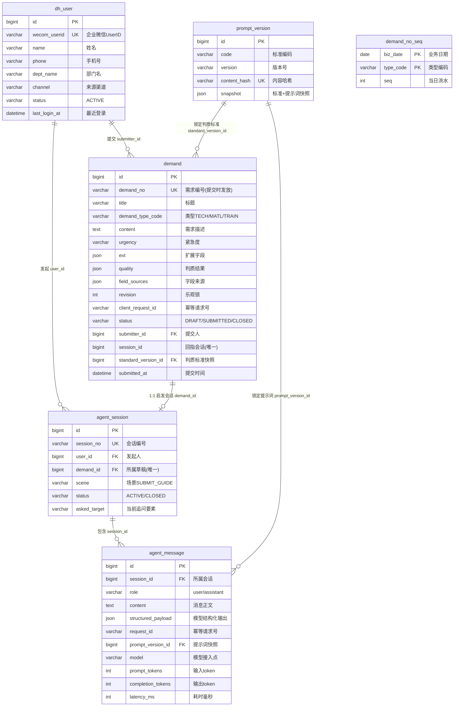

# DemandHub 数据库设计文档（Python 栈）

| 项目 | 内容 |
| --- | --- |
| 文档版本 | v1.0 |
| 编制日期 | 2026-10-07 |
| 数据库实例 | 127.0.0.1:3307（宿主机 MySQL 8.4.8，Windows 服务 `MySQL3307`） |
| 数据库 | `demandhub`（utf8mb4 / InnoDB） |
| 迁移版本 | alembic head = `0001` |
| 适用范围 | Python 栈（FastAPI 模块化单体，PR #1 合并后主线） |
| 阅读提示 | 第二章 E-R 图为 Mermaid 语法，Typora 中可直接预览 |

---

## 1. 表清单

共 7 张表，其中业务表 6 张、迁移版本表 1 张。

| 表名 | 注释 | 一句话说明 |
| --- | --- | --- |
| `demand` | 草稿与正式需求 | **核心表**。草稿和正式需求同表，用 `status` 区分生命周期 |
| `dh_user` | 渠道回源用户 | 从渠道（创金零售等）SSO 回源的用户档案 |
| `agent_session` | 每份草稿唯一启发会话 | AI 提报引导会话，与草稿 1:1 |
| `agent_message` | Agent 消息与幂等响应 | 会话消息流水，含模型调用观测字段 |
| `prompt_version` | 不可变标准与提示词快照 | 判质标准 + 提示词的不可变版本快照 |
| `demand_no_seq` | 按类型按日编号流水 | 需求编号发号器（无断号） |
| `alembic_version` | （迁移版本） | alembic 迁移版本记录，非业务表 |

---

## 2. E-R 图（Mermaid，Typora 可预览）

**关系补充说明**

- `demand.session_id` 与 `agent_session.demand_id` 是**双向唯一回指**：数据库外键建在 `agent_session.demand_id` 上（唯一约束 `uq_agent_session_demand`），`demand.session_id` 只有唯一索引（`uq_demand_session`）无外键，两端共同保证"一份草稿最多一个 AI 会话"。
- `demand_no_seq` 与 `demand` **无物理外键**，是逻辑关联：提交时按 `type_code + 当天日期` 锁定该行递增 `seq`，拼出 `demand_no`（TECH-YYYYMMDD-NNN）。
- `alembic_version` 为迁移工具表，未画入。

---

## 3. 表结构详述

### 3.1 `demand` — 草稿与正式需求（核心表）

| 列 | 类型 | 可空 | 默认 | 键/索引 | 说明 |
| --- | --- | --- | --- | --- | --- |
| id | bigint | 否 | 自增 | **PK** | 主键 |
| demand_no | varchar(40) | 是 | - | **UK** `uq_demand_no` | 需求编号，提交时才发放（TECH/MATL/TRAIN-YYYYMMDD-NNN） |
| title | varchar(256) | 是 | - | | 需求标题 |
| demand_type_code | varchar(32) | 是 | - | idx `ix_demand_type_status` | 需求类型编码 |
| subtype_code | varchar(32) | 是 | - | | 子类型编码 |
| content | text | 是 | - | | 需求描述正文 |
| urgency | varchar(16) | 否 | NORMAL | | 紧急度 |
| expect_delivery_at | date | 是 | - | | 期望交付日期 |
| ext | json | 否 | - | | 扩展字段（按标准库 schema 动态定义） |
| quality | json | 是 | - | | 要素级判质结果（OK/MISSING/VAGUE/SKIP） |
| field_sources | json | 否 | - | | 每个字段的来源标记（model/rule/default/user） |
| revision | int | 否 | 0 | | **乐观锁**：前端带版本保存，防并发覆盖 |
| client_request_id | varchar(64) | 否 | - | UK `uq_demand_create`① | 创建幂等请求号（前端生成） |
| create_request_hash | varchar(64) | 否 | - | | 创建载荷指纹（同 requestId 不同载荷则拒绝） |
| standard_version_id | bigint | 是 | - | FK → prompt_version.id | 提交时锁定的判质标准快照 |
| quality_content_hash | varchar(64) | 是 | - | | 判质时内容哈希（内容变了才重判，省钱） |
| status | varchar(16) | 否 | DRAFT | idx ②③ | DRAFT 草稿 / SUBMITTED 已提交 / CLOSED 已关闭 |
| submitter_id | bigint | 否 | - | FK → dh_user.id，idx ② | 提交人 |
| submitter_name | varchar(64) | 是 | - | | 提交人姓名快照 |
| submitter_dept | varchar(128) | 是 | - | | 提交人部门快照 |
| channel | varchar(32) | 是 | - | | 来源渠道（CHUANGJIN_LS 等） |
| session_id | bigint | 是 | - | **UK** `uq_demand_session` | 回指 AI 会话（无外键，见 §2 说明） |
| submitted_at | datetime(3) | 是 | - | idx `ix_demand_submitted` | 提交时间（毫秒精度） |
| closed_at | datetime(3) | 是 | - | | 关闭时间 |
| close_reason | varchar(256) | 是 | - | | 关闭原因 |
| created_at / updated_at | datetime(3) | 否 | 当前时间 | | updated_at 自动更新 |

> ① `uq_demand_create` = (submitter_id, client_request_id) 联合唯一 —— **创建幂等**的数据库兜底。
> ② `ix_demand_owner_status` = (submitter_id, status)；③ `ix_demand_type_status` = (demand_type_code, status)。

### 3.2 `dh_user` — 渠道回源用户

| 列 | 类型 | 可空 | 默认 | 键 | 说明 |
| --- | --- | --- | --- | --- | --- |
| id | bigint | 否 | 自增 | **PK** | 主键 |
| name | varchar(64) | 否 | - | | 姓名 |
| wecom_userid | varchar(64) | 否 | - | **UK** `uq_dh_user_wecom` | 企业微信 UserID（登录幂等键） |
| phone | varchar(32) | 是 | - | | 手机号 |
| employee_no | varchar(32) | 是 | - | | 工号 |
| email | varchar(128) | 是 | - | | 邮箱 |
| dept_id / dept_name / dept_path | varchar | 是 | - | | 部门信息（路径含层级） |
| channel | varchar(32) | 否 | CHUANGJIN_LS | | 回源渠道 |
| status | varchar(16) | 否 | ACTIVE | | ACTIVE 正常 |
| last_login_at | datetime(3) | 是 | - | | 最近登录时间 |
| created_at / updated_at | datetime(3) | 否 | 当前时间 | | |

### 3.3 `agent_session` — AI 启发会话（与草稿 1:1）

| 列 | 类型 | 可空 | 默认 | 键 | 说明 |
| --- | --- | --- | --- | --- | --- |
| id | bigint | 否 | 自增 | **PK** | 主键 |
| session_no | varchar(64) | 否 | - | **UK** `uq_agent_session_no` | 会话编号（uuid hex） |
| user_id | bigint | 否 | - | FK → dh_user.id | 发起人 |
| scene | varchar(32) | 否 | SUBMIT_GUIDE | | 场景（提报引导） |
| demand_id | bigint | 否 | - | FK → demand.id，**UK** `uq_agent_session_demand` | 所属草稿，唯一 |
| title | varchar(256) | 是 | - | | 会话标题（首条消息截断） |
| status | varchar(16) | 否 | ACTIVE | | ACTIVE 进行中 / CLOSED 已关闭 |
| asked_target | varchar(64) | 是 | - | | 当前正在追问的要素 key |
| created_at / updated_at | datetime(3) | 否 | 当前时间 | | |

### 3.4 `agent_message` — 会话消息（含幂等与模型观测）

| 列 | 类型 | 可空 | 默认 | 键/索引 | 说明 |
| --- | --- | --- | --- | --- | --- |
| id | bigint | 否 | 自增 | **PK** | 主键 |
| session_id | bigint | 否 | - | FK → agent_session.id | 所属会话 |
| role | varchar(16) | 否 | - | UK `uq_message_request_role`① | user / assistant |
| content | text | 否 | - | | 消息正文 |
| structured_payload | json | 是 | - | | 模型结构化输出（表单补丁/判质等） |
| request_id | varchar(64) | 是 | - | UK ① | 消息幂等请求号 |
| request_hash | varchar(64) | 是 | - | | 请求载荷指纹 |
| prompt_version_id | bigint | 是 | - | FK → prompt_version.id | 本次调用的提示词快照 |
| model | varchar(64) | 是 | - | | 模型接入点（如 ep-20260930122836-rv2gw） |
| prompt_tokens / completion_tokens | int | 是 | - | | token 用量 |
| latency_ms | int | 是 | - | | 模型耗时（毫秒） |
| created_at | datetime(3) | 否 | 当前时间 | | |

> ① `uq_message_request_role` = (session_id, request_id, role) 联合唯一 —— 重发同一条消息不会重复落库、重复调模型。

### 3.5 `prompt_version` — 标准与提示词快照（不可变）

| 列 | 类型 | 可空 | 默认 | 键 | 说明 |
| --- | --- | --- | --- | --- | --- |
| id | bigint | 否 | 自增 | **PK** | 主键 |
| code | varchar(64) | 否 | - | | 标准/提示词编码 |
| version | varchar(32) | 否 | - | | 版本号 |
| content_hash | varchar(64) | 否 | - | **UK** `uq_prompt_version_hash` | 内容哈希（同内容复用同一行） |
| snapshot | json | 否 | - | | 标准定义 + 提示词完整快照 |
| created_at | datetime(3) | 否 | 当前时间 | | |

### 3.6 `demand_no_seq` — 编号发号器

| 列 | 类型 | 可空 | 默认 | 键 | 说明 |
| --- | --- | --- | --- | --- | --- |
| biz_date | date | 否 | - | **PK**（联合） | 业务日期 |
| type_code | varchar(32) | 否 | - | **PK**（联合） | 类型编码 |
| seq | int | 否 | 0 | | 当日已用最大流水号 |

发号方式：`INSERT ... ON DUPLICATE KEY UPDATE seq = seq + 1`（行锁原子递增），同一事务内拼号，事务回滚则序号回收，**并发安全且无断号**。

### 3.7 `alembic_version` — 迁移版本（工具表）

| 列 | 类型 | 键 | 说明 |
| --- | --- | --- | --- |
| version_num | varchar(32) | **PK** | 当前迁移版本，现值 `0001` |

---

## 4. 关键设计说明（白话版）

1. **草稿和正式需求是同一张表。** 用户边聊边填时它是草稿（DRAFT），点提交后变正式需求（SUBMITTED）、此刻才发放需求编号；管理员关闭后变 CLOSED。好处：草稿期的所有字段、判质结果、会话关系不用搬家，提交只是改状态。
2. **幂等有双保险。** 创建需求靠 `(提交人, 请求号)` 唯一索引兜底——网络重试、双击、刷新重发都不会造出重复需求；发消息靠 `(会话, 请求号, 角色)` 唯一索引——同一条消息重发不会重复调用模型（省钱）。
3. **编号无断号。** 发号器表按"类型+日期"一行一锁，和提交在同一事务里完成，失败回滚序号自动回收。每天每类型从 001 重新编号。
4. **AI 会话与草稿严格 1:1。** 两个唯一约束双向锁定，不会出现一个草稿开出多个会话的脏数据。
5. **判质标准和提示词是"快照"，不是"引用"。** 提交那一刻用的哪版标准，就永久锁定哪版（`standard_version_id`）；每次模型调用也记下提示词版本和 token/耗时——事后审计"当时 AI 按什么标准判的、花了多少钱"都有据可查。
6. **`revision` 乐观锁。** 前端每次保存带上当前版本号，两人同时改一份草稿时后提交者会被拒绝并提示刷新，不会静默覆盖别人的修改。

---

*本文档由实际库（3307/demandhub）元数据导出生成，与 alembic 迁移 0001 一致。后续表结构变更请同步更新本文档。*
