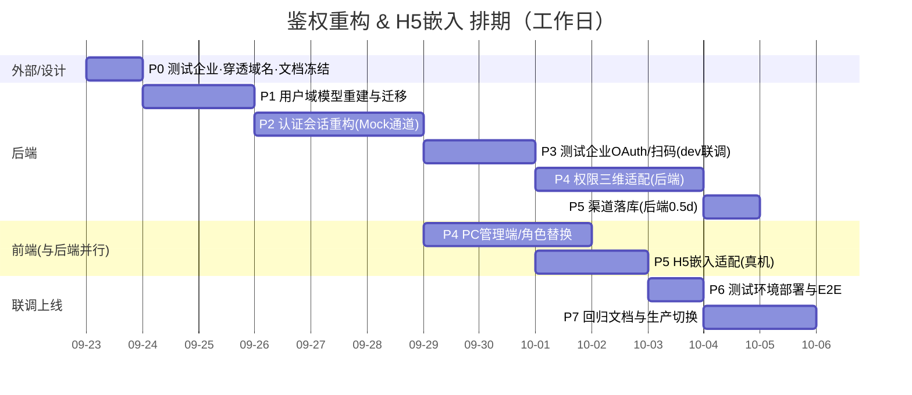

# DemandHub 用户角色与鉴权重构 & 创金零售企微 H5 嵌入 — 开发阶段计划 v1.0

> ⚠️ 本文档已作废（2026-09-22）：方案由"独立企微应用 + OAuth"改为"创金零售 SSO 票据回源校验"，DemandHub 不再注册独立企微应用。最新计划见 **《DemandHub_用户角色鉴权重构与创金零售H5嵌入_开发计划_v2.0.md》**。本文件仅保留作变更追溯。

> 编写日期：2026-09-22
> 关联文档：《系统需求规格说明书 SRS》《系统架构设计 v1.2》《系统数据库设计 v1.2》《DemandHub 嵌入创金零售_对接要求 v1.0》《开发执行计划_分阶段》
> 性质：对已上线 Mock 版本（M1~M9 已开发完成）的
> **用户域换底重构**
> \+
> **创金零售 H5 真实嵌入**
> ，不是从零开发。


***

## 1. 背景与已确认决策

代码当前建在旧版「零售统一权限中心只读镜像」方案上（`demand_user_snapshot` / `demand_org_snapshot` / 权限中心同步 Job / 5 个旧角色码），而 SRS、架构 v1.2、数据库 v1.2 已重构为「多渠道接入 + 自有 OneID」方案。本次开发完成方案对齐与真实企微嵌入。

已与需求方确认的 4 项关键决策：


| #  | 决策点    | 结论                                                                                                                                       |
| -- | ------ | ---------------------------------------------------------------------------------------------------------------------------------------- |
| D1 | 角色模型   | **角色族 + 类型范围**：角色码仅 `ADMIN / EXECUTIVE / MANAGER / HANDLER`；"管哪类" 由 `demand_type_scope`（TECH/MATL/TRAIN 多选）表达，"管哪片" 由组织子树表达。新增需求类型零代码改动。 |
| D2 | 企微对接深度 | **真实实现 + 三态环境开关，测试企业先行**：按真实企微 API 开发；dev 用 Mock、test 接公司测试企业企微（管理员可自助配置、立即开真机联调）、prod 上线时切真实生产企业。三环境代码零改动，凭证走环境变量 / Spring profile。     |
| D3 | JS-SDK | **本期不接入**。返回用 `history.back()`，拍照用 `<input type="file" accept="image/*" capture>` 原生能力。                                                  |
| D4 | 新用户策略  | **企微成员自动开通**：OAuth 能拿到企微 userid 即判定本企业员工，自动建 `ACTIVE`、`is_employee=1` 账号并可立即提报；PENDING 队列仅兜信息缺失 / 外部渠道用户。                                |

其他按推荐执行的工程决策（如需调整请在评审时提出）：


* 全系统统一 **BIGINT OneID**（`demand_user.id`），废弃字符串 `userId` 双轨；JWT、网关头、授权表统一数值 ID。

* 会话时效统一为 **access 2h / refresh 8h**（对齐架构文档与对接文档 "8 小时无感续期"）。

* 渠道以后端 OAuth 应用身份为准写入会话，提报时由后端落 `demand.channel`，不信任前端传值。

* 企微 access\_token 由 system 与 notification **通过 Redis 共享**（分布式锁刷新）。

* 系统未上线、仅 Mock 种子数据，用户域 5 张表**直接重建**，不做新旧双轨；旧镜像表保留一个迭代后删除。

* PC 端生产登录建议本期一并实现**企微扫码登录**（与 H5 OAuth 共用匹配引擎，增量约 0.5\~1 人天），否则生产环境管理员无正式登录入口；开发态保留 Mock 选人。


***

## 2. 目标与范围

### 2.1 需求 A：用户角色与鉴权管理模块（对齐 SRS FR-M1-01 \~ FR-M1-06）


1. 自有 OneID 用户体系：`demand_user` + 渠道映射 + 匹配引擎（手机号 > 企微 userid）+ 自动建号 + 用户合并 + 停用。

2. 可 CRUD 的组织树 `demand_org`（含外部虚拟组织、企微部门映射）。

3. 渠道注册管理 `demand_channel`（注册、启停、密钥脱敏、回调配置）。

4. 角色族授权 `demand_role_grant`（组织范围 + 类型多选范围 + 生效期），授权变更 1 分钟内生效。

5. PC 管理端页面：待完善用户队列、用户管理（含合并 / 停用 / 映射查看）、组织树管理、渠道管理、角色授权改造。

6. 数据权限三维落地：**角色族 × 组织子树 × 需求类型范围**（现状缺类型维度）。

### 2.2 需求 B：创金零售（企微应用）H5 嵌入（对齐对接要求 AC-01 \~ AC-06）


1. 企微网页授权静默登录（snsapi\_base）真实链路 + Mock 开关。

2. 同域 `/h5/` 部署、可信域名 / 校验文件、HTTPS。

3. 嵌入态外壳裁剪（隐藏自有 tabbar、返回回创金零售、提交后引导）。

4. 提报来源落库为 "创金零售"，后台需求列表 / 看板可按来源筛选统计。

5. 视觉对齐（深蓝导航、44px 高、标题 "需求提报"）。

6. 非企微环境 / 非可见范围 /code 失效的错误兜底。

### 2.3 本期不做（Out of Scope）


* 企微 JS-SDK（wx.config/agentConfig/jsapi\_ticket）、企微选人 / 扫码 / 定位能力。

* 语音渠道（VOICE）、机器人渠道的真实对接（渠道表预留注册位，沿用现有 Mock）。

* 企微通讯录部门全量同步（本期只在登录时按 `user/get` 取主部门，配合部门映射；全量同步另立需求）。

* 创金零售侧的入口开发与发布（对方团队负责，我方提供 URL 规范并联调）。

* 双因素认证、密码登录、SSO/CAS（SRS 已列为二期）。


***

## 3. 现状基线（改造影响面）


| 组件                                                                                                 | 现状                                         | 处理方式                              |
| -------------------------------------------------------------------------------------------------- | ------------------------------------------ | --------------------------------- |
| DDL `01-schema.sql`                                                                                | 镜像三表 + 同步水印表 + 旧角色注释                       | 新建用户域 5 表；旧表本迭代保留不删               |
| `MasterDataSyncService` / `MasterDataSyncJob` / `PermissionCenterClient`(+Mock) / `SyncController` | 权限中心全量 + 增量同步                              | **删除**；Mock 种子改为初始化器写入新表          |
| `AuthService` / `WecomClient`(+Mock) / `JwtService` / `SessionService`                             | code→权限中心查人→upsert 镜像→发 JWT                | 重写为 OAuth→企微 API→匹配引擎→OneID       |
| 网关 `AuthFilter`                                                                                    | 注入字符串 `X-User-Id` + 角色                     | 改为数值 OneID + 新增 `X-Channel`       |
| `common` 上下文 / `@RequireRole`                                                                      | 旧角色码字符串匹配                                  | 改角色族；UserContext 加 channel        |
| `DataScopeService` / `OrgScopeService` / `ActionPolicyService`                                     | 组织子树 + 旧角色，**类型 scope 未生效**                | 补类型维度；写操作鉴权加类型参数                  |
| `StateMachineConfig`（内置默认规则）                                                                       | REPORTER/HANDLER/DEMAND\_MANAGER/EXECUTIVE | 改为 HANDLER/MANAGER 族；类型校验在业务层     |
| 跨服务 View（demand/notification/agent 共 35 处引用 `UserSnapshotView`/`OrgSnapshotView`/`RoleGrantView`）  | 直读镜像表                                      | **保留 View 接口、底层改读新表**，字段统一为 OneID |
| PC：login /router/layout 菜单 /directives/grant.vue                                                   | 旧 5 角色、类型范围单选                              | 全量替换角色族；新增用户 / 组织 / 渠道管理页         |
| H5：router 守卫 /auth 页 / AppLayout /report                                                           | Mock 选人、`router.back()`、channel 写死 `'H5'`  | OAuth 重定向、嵌入态裁剪、渠道后端落库            |
| nginx / vite                                                                                       | H5 独立 81 端口、未配 base                        | 同域 `/h5/` 分流、vite `base:'/h5/'`   |

旧角色码全库分布：**33 个文件、71 处**（Java + TS/Vue + SQL），逐文件替换并靠编译与回归兜底。


***

## 4. 总体技术方案

### 4.1 用户域数据模型（库设计 v1.2 基础上的两处补充）


* `demand_user`：OneID 主键 BIGINT；登录账号 `login_name` 唯一；状态 PENDING/ACTIVE/DISABLED/MERGED；`merged_to_user_id`；最后登录渠道 / IP / 时间。

* `demand_org`：组织树自引用 + 物化路径 `path` + `org_kind`（INTERNAL/EXTERNAL）；**新增&#x20;**`external_dept_id VARCHAR(32)` 存企微部门 ID，用于 OAuth 登录部门匹配（库设计需补此字段）。

* `demand_channel`：渠道注册表，预置 WEB / WECOM\_APP / CHUANGJIN\_LS / WECOM\_BOT / VOICE；企微类渠道存 corpid/agentid/secret（加密存储，接口脱敏返回）。

* `channel_user_mapping`：(channel\_id, channel\_user\_id) 唯一；匹配优先级手机号 > 企微 userid。

* `demand_role_grant`：`demand_user_id` BIGINT；`role_code` 仅四族；`org_id`（空 = 全组织）；`demand_type_scope`（逗号分隔，空 = 全部类型）；生效期；唯一键 `(demand_user_id, role_code, org_id, demand_type_scope)`。

### 4.2 角色族与权限判定


```
功能权限（能不能点按钮/调接口）：@RequireRole 判角色族 —— ADMIN / EXECUTIVE / MANAGER / HANDLER

数据范围（能看到哪些需求）：DataScope = 角色族 × 组织子树(path LIKE) × 类型集合(demand\\\_type\\\_scope)

操作鉴权（能不能对这一条需求流转）：OrgScope.canManage/canHandle(user, orgId, typeCode)

\&#x20;  \\= 角色族命中 ∧ 承接组织在授权组织子树内 ∧ 需求类型在授权类型集合内
```


* 提报权限：任何 `ACTIVE` 登录用户即可（无 REPORTER 角色、无授权记录）；PENDING 仅可提报 + 查看本人需求。

* 状态机 `TransitionRule` 角色集合改为族（MANAGER 族含 EXECUTIVE）；受理 / 退回 / 分派 / 评审等经理事件在 Service 层追加类型 + 组织校验（引擎加载 DemandEntity 后可获得 typeCode 与承接组织）。

* 授权变更：删该用户 access 会话、保留 refresh（现状机制），前端 401 自动刷新重签 → 1 分钟内拿到新角色；停用 / 合并用户同时删 refresh 强制登出。

### 4.3 H5 企微 OAuth 静默登录时序（真实模式）


```
创金零售 webview → https://{域名}/h5/report?from=chuangjinls

\&#x20; → H5 守卫发现无 token

\&#x20; → GET /api/system/auth/oauth-url?from=chuangjinls\\\&redirect=/h5/report

\&#x20;    后端生成 state 存 Redis(5min)，返回企微授权 URL

\&#x20; → 302 https://open.weixin.qq.com/connect/oauth2/authorize

\&#x20;      ?appid={corpid}\\\&redirect\\\_uri={URL编码回跳}\\\&response\\\_type=code

\&#x20;      \\\&scope=snsapi\\\_base\\\&agentid={DemandHub应用agentid}\\\&state={state}#wechat\\\_redirect

\&#x20; → 企微回跳 /h5/report?from=chuangjinls\\\&code=xxx\\\&state=xxx

\&#x20; → GET /api/system/auth/silent?code=\\\&from= （校验 state）

\&#x20;    后端：gettoken(Redis 共享) → auth/getuserinfo?code → userid

\&#x20;         → user/get?userid 取姓名/手机/主部门

\&#x20;         → 渠道匹配引擎（手机>userid；命中更新映射；未命中自动建号 ACTIVE）

\&#x20;         → 部门按 external\\\_dept\\\_id 映射 demand\\\_org，匹配不到挂"未分配组织"(EXTERNAL)

\&#x20;         → 签发 JWT，会话写入 channel=CHUANGJIN\\\_LS

\&#x20; → H5 存 token，进入提报页（全程无登录页、无感知）

Mock 模式：oauth-url 返回 mock 标识 → H5 跳现有 /auth 选人页。
```

PC 扫码（建议纳入）：`https://login.work.weixin.qq.com/wwlogin/sso/login?appid=&agentid=&redirect_uri=&state=` 扫码回调走同一匹配引擎，channel=WEB。

### 4.4 渠道来源落库


* `SessionUser` 增加 `channel`；网关鉴权后注入 `X-Channel` 头；`UserContext` 增加 channel 字段。

* `DemandSubmitService` 提交 / 草稿渠道取 `UserContext.channel`，缺省 `WEB`，**忽略前端传入的 channel**。

* `from=chuangjinls` 仅控制 H5 外壳展示；真正落库值由登录渠道决定（WECOM\_APP / CHUANGJIN\_LS）。

* PC 需求列表与看板增加 "需求来源" 筛选项与统计（复用 `demand.channel` 字段）。

### 4.5 部署形态（同域分流）


```
server {

\&#x20; listen 80;

\&#x20; location /h5/   { alias /usr/share/nginx/html/h5/; try\\\_files \\\$uri \\\$uri/ /h5/index.html; }

\&#x20; location /api/  { proxy\\\_pass http://demandhub\\\_gateway; ... SSE 关缓冲 ... }

\&#x20; location = /WW\\\_verify\\\_\\\*.txt { root /usr/share/nginx/verify/; }   # 企微可信域名校验

\&#x20; location /      { root /usr/share/nginx/html/pc; try\\\_files \\\$uri \\\$uri/ /index.html; }

}
```


* H5：vite `base:'/h5/'`，路由已用 `createWebHistory('/h5/')`；构建产物部署到 `/h5/`。

* 企微侧仅需配置一个可信域名（HTTPS）；创金零售跳转地址、OAuth 回跳地址均为该域。

### 4.6 三环境开关策略（dev /test/prod）


| 环境         | mock 开关              | 企微凭证                                           | 用途                                                 |
| ---------- | -------------------- | ---------------------------------------------- | -------------------------------------------------- |
| dev（本地）    | 默认 `true`，可切 `false` | mock=true 不填；切真实时复用测试企业凭证                      | 默认 Mock 做业务开发；联调登录时 mock=false，经内网穿透直连测试企业（见 12.2） |
| test（测试部署） | `false`              | **测试企业** corpid/agentid/secret + 测试公网 HTTPS 域名 | 真机 OAuth、通讯录、PC 扫码、可见范围、异常态全部真实联调                  |
| prod（生产）   | `false`              | **生产企业**凭证 + 生产域名                              | 上线时仅换环境变量与域名，代码 / 镜像不变                             |

关键约束：


* 配置走 Spring profile（`application-dev.yml` / `application-test.yml` / `application-prod.yml`）+ 环境变量注入密钥；`demand_channel` 里企微渠道的 corpid/agentid 按环境初始化，secret 不落库、不入仓库。

* **企微 userid 仅企业内唯一、跨企业不一致**：测试企业产生的 `channel_user_mapping` 与 OneID 测试数据不得带入生产。测试库与生产库物理隔离；若复用同一套环境升级上线，上线前必须清理测试企业渠道映射与测试账号（见第 12 节切换清单）。

* **测试企业没有 "创金零售" 应用**：在测试企业自建一个 "模拟创金零售入口" 应用（主页 / 菜单配置为 H5 链接），或直接在企微会话内打开 H5 URL，即可验证企微 webview + OAuth 静默登录 + `history.back()` 返回全链路；真正的跨应用发布与可见范围策略只在生产联调窗口验证。


***

## 5. 分阶段开发计划（WBS）

> 工时按 "后端 1 人 + 前端 1 人可并行" 估算，单位人天（PD）。关键路径见第 10 节。

### P0 — 外部依赖启动与设计冻结（0.5 PD，立即启动，等待时间不计入工时）


| 任务                                  | 负责         | 说明                                                                                                                          |
| ----------------------------------- | ---------- | --------------------------------------------------------------------------------------------------------------------------- |
| 测试企业创建 DemandHub-Test 自建应用（管理员即时可做） | 需求方（企微管理员） | corpid、agentid、secret、可见范围、测试部门 / 成员、敏感信息授权，操作清单见第 12 节**并行申请**：生产企业 DemandHub 正式应用（上线前到位，可见范围全员）                           |
| 准备 HTTPS 域名与可信域名                    | 运维         | **测试环境先行**：准备公网 HTTPS 域名（测试服务器或内网穿透），配置 "网页授权及 JS-SDK 可信域名" 并上传 WW\_verify 校验文件，PC 扫码另配 "企业微信授权登录" 域名；生产域名 / 证书并行审批         |
| 本地穿透（dev 直连测试企业）                    | 后端         | 内网穿透固定域名（cpolar/natapp/frp）映射本地网关与 H5 并配为可信域名；产出本地 .env 模板与启动说明                                                             |
| 与创金零售团队锁定入口与联调窗口                    | 产品         | 跳转 URL 规范、视觉规范复核、联调 / 灰度时间                                                                                                  |
| 文档修订（设计冻结）                          | 后端         | SRS 角色矩阵 / 枚举改角色族、PENDING 策略（D4）、渠道枚举；架构文档角色 / JWT 头 / TTL/token 共享；库设计角色注释 + `external_dept_id`；对接文档补前置条件、错误态、纠正 JS-SDK 说法 |

**交付物**：测试企业应用参数（corpid/agentid/secret）与测试域名配置（密钥走环境变量，不入仓库）、生产应用申请回执与到位时间、联调排期、修订后的 4 份设计文档。

**验收**：测试企业凭证与可信域名可用，P4 第一天即可真机联调；生产凭证有明确到位时间；文档评审通过。


***

### P1 — 用户域数据模型重建与迁移（后端 2 PD）


| #   | 任务                                    | 说明                                                                                                                                                |
| --- | ------------------------------------- | ------------------------------------------------------------------------------------------------------------------------------------------------- |
| 1.1 | 新 DDL 脚本 `06-rebuild-user-domain.sql` | 建 demand\_user /demand\_org/demand\_channel/channel\_user\_mapping/demand\_role\_grant (新)；索引、唯一键、外键按库设计 v1.2 + `external_dept_id`                |
| 1.2 | 渠道与组织 / 用户种子                          | 5 个渠道；原 Mock 组织树 10 个节点迁入 demand\_org（**id 保留 100\~141**）；原 7 个 Mock 用户迁入 demand\_user（**id 保留 1001\~1007**）并写 channel\_user\_mapping（mock 企微 id） |
| 1.3 | 旧角色授权迁移                               | ADMIN/EXECUTIVE 原样；DEMAND\_MANAGER→MANAGER 并按其组织推断 type\_scope（110→TECH，120→MATL，130→TRAIN）；HANDLER→HANDLER + 同口径 scope；REPORTER 授权丢弃             |
| 1.4 | 跨服务 View 换底                           | demand/notification/agent 的 UserSnapshotView/OrgSnapshotView/RoleGrantView 改读新表（数值 OneID、name/phone/org 字段对齐）；旧镜像表本迭代保留                           |
| 1.5 | 数据初始化器替代同步 Job                        | 用 `CommandLineRunner`（Mock 模式）写入种子；删除 MasterDataSyncService/Job、pcenter 包、SyncController 与水印表的代码引用（表暂不 DROP）                                      |
| 1.6 | 回滚脚本                                  | `06-rollback.sql`（保留旧表即可回滚 View 定义）                                                                                                               |

**验收**：全新初始化与 "旧库升级" 两条路径都验证通过；demand/assignment/comment 等业务表外键因 id 保留无需改动；启动无同步 Job 报错。


***

### P2 — 认证与会话链路重构（后端 3 PD）


| #   | 任务                          | 说明                                                                                                                                    |
| --- | --------------------------- | ------------------------------------------------------------------------------------------------------------------------------------- |
| 2.1 | 用户域实体 / Mapper/Service      | DemandUser、DemandOrg、DemandChannel、ChannelUserMapping、DemandRoleGrant 的 MP 实体与 Mapper                                                 |
| 2.2 | 渠道匹配引擎 `ChannelUserMatcher` | 手机精确匹配 > 企微 userid 匹配；命中更新映射与最后登录；未命中按 D4 建号（企微渠道 ACTIVE / 员工，其他渠道 PENDING）；同手机多 OneID 触发合并提示 / 自动合并规则                                |
| 2.3 | 用户合并服务 `UserMergeService`   | 迁移 demand/comment/attachment/assignment/worklog/notification/mapping/grant；被合并账号置 MERGED；记录合并审计（操作人 / 时间 / 原因 / 迁移条目数）                |
| 2.4 | AuthService 重写              | oauth-url（含 state）、silent（真实 / Mock 双通道）、login（PC Mock 保留）、me、logout、refresh；登录返回体增加 channel、typeScopes                               |
| 2.5 | JWT / 会话调整                  | claims 以 uid (OneID) 为主；SessionUser 加 channel；TTL 改 access 2h /refresh 8h；授权变更 / 停用 / 合并的会话失效策略                                       |
| 2.6 | 网关与 common                  | AuthFilter 注入数值 `X-User-Id` 与 `X-Channel`；白名单收敛（oauth-url/silent/login/refresh/mock-users）；UserContext/CurrentUser/@RequireRole 支持角色族 |
| 2.7 | 组织 / 授权基础接口                 | org tree/list（登录用户可读）；grant CRUD 改 BIGINT + 族角色 + 类型多选；变更后失效会话                                                                        |

**验收（Mock 模式）**：H5/PC 登录、刷新、登出全通；伪造 X-User-\* 头被剥离；停用 / 合并 / 改授权后按预期失效；单元测试覆盖匹配引擎与合并。


***

### P3 — 真实企微 OAuth 与 PC 扫码（后端 2 PD，dev 直连测试企业即时联调）


| #   | 任务                         | 说明                                                                                                       |
| --- | -------------------------- | -------------------------------------------------------------------------------------------------------- |
| 3.1 | 真实企微客户端 `WecomOauthClient` | gettoken /auth/getuserinfo/user/get；test/prod 同一套代码，仅 profile 与环境变量不同（见 4.6）；corpid/agentid/secret 走环境变量 |
| 3.2 | token 集中共享                 | Redis key `wecom:access_token` + 分布式锁刷新；notification 现有 Mock WecomTokenManager 改为 Redis 实现，两端共用          |
| 3.3 | state 与错误兜底                | state 防 CSRF；非可见范围（getuserinfo 返回非企业成员 / 无 userid）、code 失效、非企微 UA 的明确错误码与提示页                             |
| 3.4 | 部门映射                       | user/get 主部门 → demand\_org.external\_dept\_id；未匹配挂 "未分配组织 (EXTERNAL)"，不阻塞登录提报                            |
| 3.5 | PC 企微扫码登录（建议纳入）            | wwlogin 扫码 → code → 同一匹配引擎；开发态保留 Mock 选人入口                                                               |
| 3.6 | dev 穿透与联调支持                | 本地内网穿透（建议固定域名）暴露 HTTPS 回调并配置为可信域名；企微接口日志脱敏；企微不可用时 H5 给维护提示，不放行伪造登录                                       |

**验收**：dev（内网穿透）与 test 部署均可直连测试企业，真机完成 H5 静默登录、PC 扫码；Mock 模式随时可切回；未匹配人员自动建号且可提报；非可见范围 /code 失效 /state 篡改等异常态有友好提示。prod 切换只验凭证与域名，不重复功能测试。


***

### P4 — 角色族权限全链路适配 + PC 管理端（后端 2.5 PD / 前端 3 PD，并行）

**后端**


| #   | 任务                   | 说明                                                                                                                |
| --- | -------------------- | ----------------------------------------------------------------------------------------------------------------- |
| 4.1 | DataScopeService 三维化 | 角色族 × 组织子树 × 类型集合；缓存键含版本；提报人 / 经理 / 处理人 / 管理层 / 管理员五类视图重算                                                         |
| 4.2 | OrgScopeService 类型化  | canManage/canHandle 增加 typeCode 参数；经理受理 / 分派 / 评审按类型 + 组织双重命中                                                     |
| 4.3 | 状态机角色替换              | 内置默认规则与库里 JSON 规则统一为 MANAGER/HANDLER 族；类型校验在 DemandStateMachine 调用前后的 Service 层落地                                 |
| 4.4 | Controller 注解替换      | Triage/Solution/Dashboard/ReportExport 等全部旧角色码（71 处分布）替换；ActionPolicyService 功能矩阵按 SRS 第 4 节重写                    |
| 4.5 | 管理端接口                | 用户：分页 (状态 / 渠道 / 组织筛选)、详情、补全、激活、停用、合并、映射查看；组织：CRUD + 路径重算 + 删除引用校验 + external\_dept\_id 维护；渠道：列表 / 注册 / 启停 / 密钥脱敏 |
| 4.6 | 通知 / Agent 适配        | RecipientResolver、WecomPushConsumer、RagController 等 View 引用方按新字段编译修复                                              |

**前端 PC**


| #    | 任务       | 说明                                                                                      |
| ---- | -------- | --------------------------------------------------------------------------------------- |
| 4.7  | 角色体系替换   | 路由 meta.roles、layout 菜单（isManagerLike 等）、v-role 指令、ROLE\_LABELS、登录页、需求列表 / 详情 / 看板按钮条件  |
| 4.8  | 角色授权页改造  | 角色 4 族；类型范围改多选；组织树选择；授权记录列表                                                             |
| 4.9  | 用户管理页（新） | 用户列表 + 待完善队列 (PENDING) + 侧栏补全 (姓名 / 手机 / 组织 / 员工标识) + 停用 / 启用 + 合并对话框（源 / 目标、影响预览、二次确认） |
| 4.10 | 组织管理页（新） | 树 CRUD、层级 / 类型 (承接 / 提报 / 外部)、企微部门 ID 维护、删除引用拦截提示                                       |
| 4.11 | 渠道管理页（新） | 渠道列表、注册 / 启停、回调地址、密钥 "存后不回显"、同步状态展示                                                     |
| 4.12 | 需求来源筛选   | 列表筛选 + 看板按 channel 统计                                                                   |

**验收**：SRS 第 4 节权限矩阵逐项走查（科技 / 物料 / 培训经理互不可见对方待受理队列、不能跨类型受理；处理人仅见本类型池；提报不受授权影响）；M2\~M9 全量冒烟通过。


***

### P5 — H5 嵌入适配（前端 2 PD / 后端 0.5 PD，基于测试企业真实链路）


| #   | 任务         | 说明                                                                                       |
| --- | ---------- | ---------------------------------------------------------------------------------------- |
| 5.1 | OAuth 前端链路 | 守卫：无 token 调 oauth-url → 企微重定向；state 存取校验；Mock 模式跳选人页；登录失败错误页                            |
| 5.2 | 嵌入态外壳      | `from=chuangjinls` 时 AppLayout 隐藏底部 tab 栏、仅留左上角返回（`history.back()` 回创金零售）；独立企微应用进入保留完整外壳 |
| 5.3 | 提报成功引导     | 成功页按钮 "继续提报 / 返回创金零售（history.back）"                                                      |
| 5.4 | 渠道落库（后端）   | 网关注入 X-Channel → UserContext → DemandSubmitService 写 demand.channel；草稿同口径；前端不再传 channel  |
| 5.5 | 视觉对齐       | 主色统一 `#1F3A8A`（现状 #1a3a6b 一并修正）、导航 44px、标题 "需求提报"；安全区适配                                  |
| 5.6 | 构建与 base   | vite `base:'/h5/'`；验证刷新 / 深链 `/h5/report` 不 404                                          |

**验收（测试企业真机）**：从「创金零售 - Mock」进入无登录页直达提报表单；嵌入态无 tabbar、左上角可返回；来源落库 CHUANGJIN\_LS；独立应用入口外壳完整；提报 / 拍照 / 附件 / 草稿在企微 webview（iOS / 安卓）正常。


***

### P6 — 测试环境部署与端到端验收（1 PD）


| #   | 任务      | 说明                                                                           |
| --- | ------- | ---------------------------------------------------------------------------- |
| 6.1 | 测试环境部署  | docker-compose/nginx 同域 /、/h5/、/api 分流；WW\_verify 校验文件托管与测试 HTTPS 证书；SSE 关缓冲 |
| 6.2 | 可信域名核对  | 测试企业网页授权域名、PC 扫码回调域名与穿透 / 测试域名一致（生产域名在 P7 切换时配置）                             |
| 6.3 | 模拟入口联调  | 测试企业「创金零售 - Mock」应用跳入与返回、DemandHub-Test 独立应用入口两条路径均验证                        |
| 6.4 | 真机端到端   | 企微客户端：进入→静默登录→提报→PC 受理分派→方案→验收→企微消息触达；iOS / 安卓各走一遍                           |
| 6.5 | AC 逐项验收 | 按对接文档 AC-01\~06 与本计划第 9 节对照表逐项确认                                             |


***

### P7 — 回归、文档与生产切换上线（2 PD）


| #   | 任务      | 说明                                                                             |
| --- | ------- | ------------------------------------------------------------------------------ |
| 7.1 | 自动化测试   | 匹配引擎 / 合并 / 数据权限矩阵 / 状态机族鉴权单测；WecomOauthClient 用 MockWebServer 模拟企微响应；关键链路集成测试 |
| 7.2 | 回归      | M1\~M9 全量回归（重点：通知收件人解析、看板、报表、Agent 提报）                                         |
| 7.3 | 文档交付    | 更新 SRS / 架构 / 库设计 / 开发计划 / 对接文档；运维手册（企微密钥轮换、渠道启停、可见范围变更、合并审计查询）                |
| 7.4 | 生产切换与灰度 | 执行 12.4 checklist：prod 凭证 / 域名、测试数据隔离清理、生产可见范围核对、创金零售正式入口发布、5\~10 人真机灰度后全量     |
| 7.5 | 旧表清理与回滚 | 稳定一个迭代后 DROP 镜像三表与水印表（单独变更单）；保留回滚脚本与镜像版本                                       |


***

## 6. 接口清单（新增 / 改造 / 废弃）

**认证（/system/auth）**


| 方法路径                                           | 状态   | 说明                                                   |
| ---------------------------------------------- | ---- | ---------------------------------------------------- |
| GET /system/auth/oauth-url                     | 新增   | 入参 from、redirect；返回授权 URL 与 state（Mock 模式返回 mock 标识） |
| GET /system/auth/silent                        | 改造   | 增 state 校验、真实企微链路；返回体加 channel、typeScopes            |
| POST /system/auth/login                        | 保留改造 | PC Mock / 扫码后换 token                                 |
| GET /system/auth/me、POST /refresh、POST /logout | 改造   | OneID 化                                              |
| GET /system/auth/mock-users                    | 保留   | 仅 mock=true 且非生产环境暴露                                 |

**用户（/system/user，ADMIN）**：GET /page（增 status/channel/org 筛选）、GET /{id}、PUT /{id}（补全）、POST /{id}/activate、POST /{id}/disable、POST /merge、GET /{id}/mappings。

**组织（/system/org）**：GET /tree、/list（登录可读）；POST、PUT /{id}、DELETE /{id}（ADMIN，引用校验）。

**渠道（/system/channel，ADMIN）**：GET /list、POST、PUT /{id}（启停 / 回调 / 密钥，密钥存后不回显）。

**授权（/system/grant，ADMIN）**：page/POST/PUT/DELETE 改造为 BIGINT 用户 ID + 族角色 + 类型多选。

**废弃**：POST /system/sync/trigger 及 pcenter 整套适配类。

## 7. 配置项清单


```
demandhub:

\&#x20; auth:

\&#x20;   access-ttl-hours: 2

\&#x20;   refresh-ttl-hours: 8

\&#x20; integration:

\&#x20;   wecom:

\&#x20;     mock: true            # dev=true（Mock）；test/prod=false（真实企微，凭证按环境注入）

\&#x20;     corp-id: \\\${WECOM\\\_CORP\\\_ID}

\&#x20;     apps:

\&#x20;       demandhub:

\&#x20;         agent-id: \\\${WECOM\\\_DEMANDHUB\\\_AGENT\\\_ID}

\&#x20;         secret: \\\${WECOM\\\_DEMANDHUB\\\_SECRET}

\&#x20;     oauth:

\&#x20;       h5-redirect-base: https://{域名}/h5

\&#x20;       pc-redirect-base: https://{域名}

\&#x20; channel:

\&#x20;   default-unassigned-org-id: 900   # 未分配组织(EXTERNAL)
```

三套 profile 与环境变量对应关系：


| profile              | `wecom.mock` | WECOM\_CORP\_ID / AGENT\_ID / SECRET | H5/PC REDIRECT\_BASE                  |
| -------------------- | ------------ | ------------------------------------ | ------------------------------------- |
| application-dev.yml  | true         | 不填（Mock）                             | [localhost](https://localhost) / 内网穿透 |
| application-test.yml | false        | 测试企业凭证                               | 测试公网 HTTPS 域名                         |
| application-prod.yml | false        | 生产企业凭证                               | 生产域名                                  |

> 同一变量名在不同部署环境注入不同值；镜像与代码在 test→prod 间完全不变，切换只改部署配置。

## 8. 数据迁移要点


1. `demand_user` 用 `INSERT ... SELECT` 保留原 snapshot 数值 id → demand 等业务表外键零改动。

2. `demand_org` 保留 100\~141 原 id 与 path；新增 EXTERNAL 根 "未分配组织"。

3. `demand_role_grant` 重建：字符串 user\_id 经 snapshot 映射为数值 id；角色与 scope 按 1.3 口径转换。

4. channel\_user\_mapping 从 snapshot.wecom\_id 回填（mock 数据）；真实企微首次登录自动补真实 userid。

5. 旧表（snapshot 两表 + 旧 grant + 水印表）本迭代保留只读，P7 后单独提单 DROP。

## 9. 验收对照表（摘要）


| 来源       | 验收项                                | 对应阶段                   |
| -------- | ---------------------------------- | ---------------------- |
| AC-01    | 企微内点入口无感知登录直达提报页                   | P3/P5/P6               |
| AC-02    | 自动获取姓名 / 手机 / 部门，免手工               | P3（手机受企微权限限制时允许为空，不阻塞） |
| AC-03    | 提报字段 / 附件 / 草稿与独立 H5 一致            | P5 + 回归                |
| AC-04    | 导航 "需求提报"、左上角返回回创金零售               | P5                     |
| AC-05    | 企微 webview 兼容、不弹浏览器登录              | P6 真机                  |
| AC-06    | 后台来源标识为 "创金零售"，可筛选统计               | P4/P5                  |
| FR-M1-01 | 渠道接入 / 匹配 / 自动建号 / PENDING 队列 / 合并 | P1/P2/P3（企微链路）/P4（管理页） |
| FR-M1-03 | 角色授权 CRUD + 1 分钟生效                 | P2/P4                  |
| FR-M1-04 | 组织树 CRUD                           | P4                     |
| FR-M1-05 | 渠道注册 / 启停 / 密钥脱敏                   | P4                     |
| FR-M1-06 | 权限矩阵（含类型维度）                        | P4                     |
| NFR      | 伪造头剥离、越权 403、审计留痕 3 年              | P2/P3/P4/P7            |

## 10. 排期概览（关键路径）





* 开发工作量合计约 **19 人天**（后端约 14、前端约 5，部分并行）。

* 关键路径约 **16 个工作日（3 周多）**，不含企微审批 / 域名备案等外部等待；P0（测试企业与穿透域名）第一天就绪后，P3 起全程在真实企微链路上开发。

## 11. 主要风险与对策


| 风险                            | 影响                        | 对策                                                       |
| ----------------------------- | ------------------------- | -------------------------------------------------------- |
| 企微应用可见范围未覆盖使用人                | OAuth 拿不到 userid，AC-01 失败 | P0 锁定全员可见；错误态明确提示 "无应用权限，请联系管理员"                         |
| 可信域名 / HTTPS 审批慢              | 无法真机联调                    | P0 立即申请；Mock 模式保证开发不阻塞                                   |
| user/get 手机号无敏感权限             | 手机匹配失效                    | 退化为企微 userid 匹配自动建号；手机号登录后由用户补全                          |
| 角色码替换面广（33 文件）                | 编译 / 越权回归风险               | View 层换底收敛改动 + 全量编译 + 权限矩阵走查 + M2\~M9 回归                 |
| 创金零售入口发布时间不可控                 | 上线依赖对方                    | 我方按 URL 规范先行，联调窗口提前预约；对方未发布不影响独立企微应用上线                   |
| 两服务刷 token 互相影响               | 登录 / 消息偶发失败               | Redis 共享 token + 分布式锁，单点刷新                               |
| 组织部门映射不准                      | 经理看不到本部门需求                | EXTERNAL 兜底不阻塞提报；PC 组织管理页维护映射与批量调整                       |
| 重构影响已交付 M2\~M9                | 存量功能回归                    | 旧表保留一迭代可回滚；View 接口不变；逐模块回归清单                             |
| 测试 / 生产企业 userid 不一致，测试数据带入生产 | 孤儿映射、错误合并账号               | 测试库与生产库物理隔离；复用环境时上线执行测试数据清理脚本（见 12.4）                    |
| 测试企业无 "创金零售" 应用               | 跨应用跳转测试期无法验证              | 建 "创金零售 - Mock" 入口应用验证 webview/OAuth/ 返回；正式跨应用发布列入生产联调窗口 |
| 测试环境无公网 HTTPS 域名              | OAuth 回跳不可达、可信域名无法校验      | 测试服务器部署或内网穿透；redirect 域名与可信域名一致、校验文件可访问                  |


***

## 12. 测试企业准备清单与生产切换 Checklist

### 12.1 测试企业管理后台准备（P0，企微管理员自助）


1. **企业信息**：记录测试企业 corpid（我的企业 → 企业信息 → 企业 ID）。

2. **自建应用**：应用管理 → 自建 → 创建「DemandHub-Test」，记录 agentid、secret。

3. **可见范围**：设为全员或测试项目组（为验证 "可见范围外成员" 异常态，另准备一个被排除的成员）。

4. **测试部门与成员**：通讯录建与种子组织对应的部门（财管科技产品部 / 客户陪伴服务部 / 培训开发部 / 营业部）和测试成员；userid 可按 `u_mgr_tech` 等规划便于对照；成员手机号填真实号码，用于验证 "手机号匹配" 路径。

5. **敏感信息授权**：开启应用对成员手机号 / 邮箱的获取权限（或提供通讯录同步 secret 供 `user/get`）；同时验证拿不到手机号时降级为 userid 匹配的链路。

6. **可信域名**：应用详情 → 网页授权及 JS-SDK 域名，填测试域名并上传 `WW_verify_*.txt`（由 nginx 托管）。

7. **PC 扫码**：配置 "企业微信授权登录" 回调域名。

8. **模拟创金零售入口**：再建一个自建应用「创金零售 - Mock」，主页地址填 `https://{测试域名}/h5/report?from=chuangjinls`，用于模拟跨应用跳入与返回。

9. 手机企微切换到测试企业（同一手机号可加入多个企业，入口在 "我 → 设置 → 切换企业"）。

### 12.2 网络与域名（dev 穿透 /test 部署）


* 优先测试服务器公网 HTTPS 部署；本地联调用内网穿透（cpolar /natapp/frp）映射网关与 H5。

* `redirect_uri` 域名必须与配置的可信域名一致；校验文件需经 80/443 公网可访问。

* 测试环境 MySQL / Redis 与生产物理隔离。

* dev 日常业务开发保持 `mock=true`（离线、构造角色快）；仅登录 / 嵌入联调时切 `mock=false` 走穿透；穿透免费域名会变，建议固定域名套餐，域名变更后同步更新企微可信域名。

### 12.3 测试企业真机用例（P3/P5/P6 验收）


* 测试成员从「创金零售 - Mock」进入 → 静默登录直达提报页，无登录页、无浏览器弹窗；

* 首次登录自动建号，姓名 / 部门回填；手机号命中、手机号缺失两条路径分别验证；

* 可见范围外成员进入 → 明确 "无应用权限" 提示；code 失效 / 重放、state 篡改 → 拒绝并提示；

* PC 扫码登录成功；提报落库 `channel=CHUANGJIN_LS`，PC 后台可筛选；左上角返回回到 Mock 入口应用。

### 12.4 生产切换 Checklist（P7.4 上线窗口）


* [ ] 生产企业自建应用 DemandHub 创建完成，corpid/agentid/secret 注入 prod 环境变量；

* [ ] 生产应用可见范围覆盖全员（至少覆盖创金零售全部使用人）；

* [ ] 生产可信域名、HTTPS 证书、`WW_verify` 校验文件、PC 扫码回调域名配置完成；

* [ ] 部署 profile=prod、`wecom.mock=false` 核对并灰度发布；

* [ ] **数据隔离**：生产库不含测试企业的 channel\_user\_mapping / 测试 OneID；若复用测试环境升级，先执行清理脚本（删测试渠道映射、PENDING 测试账号及其测试需求）；

* [ ] 创金零售团队配置正式入口 URL 并联调通过；

* [ ] 内部 5\~10 人真机灰度（iOS / 安卓）后全量；

* [ ] 回滚预案就绪：配置切回 test/mock 或回退镜像，旧镜像表保留期内可回滚。