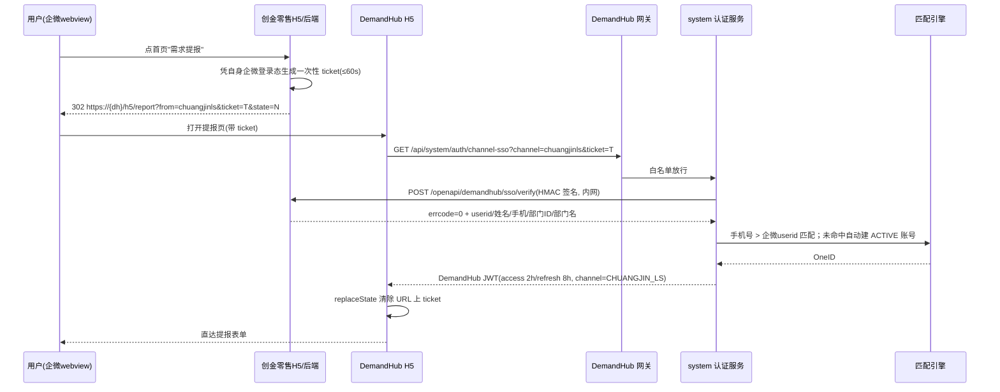
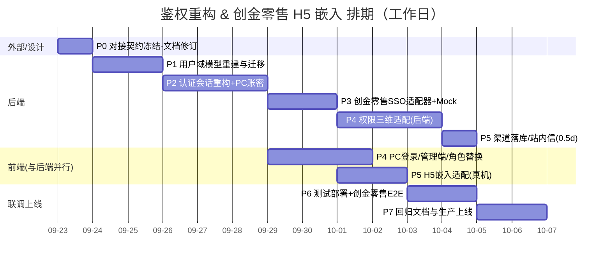

# DemandHub 用户角色与鉴权重构 & 创金零售 H5 嵌入 — 开发阶段计划 v2.0（渠道 SSO 票据版）

> 编写日期：2026-09-22　|　主责：财管科技产品部 DemandHub 团队
> **v2.0 相对 v1.0 的核心变化**
>
> ：DemandHub 
>
> **不注册独立企微应用**
>
> ，创金零售作为提报渠道之一，以
>
> **一次性 SSO 票据 + 服务端回源校验**
>
> 方式完成嵌入登录；PC 管理端改为
>
> **账号密码登录**
>
> ；通知一期只做
>
> **站内信**
>
> 。配套文档《DemandHub_H5 嵌入创金零售_技术方案与对接标准
>
> \_v2.0.md
>
> 》。
> v1.0（独立企微应用 + OAuth + 可信域名 + PC 扫码）已作废。

***

## 1. 背景与基线

代码当前建在旧版「零售统一权限中心只读镜像」方案上（`demand_user_snapshot` / `demand_org_snapshot` / 权限中心同步 Job / 5 个旧角色码，71 处旧角色引用、192 处跨服务 View 引用），与现行 SRS v1.3、架构 v1.0（渠道接入版）、库设计 v1.0（渠道接入版）的「多渠道接入 + 自有 OneID」方向一致，但**渠道登录的具体实现方式需要按本版方案修正**：不直接对接企微 OAuth，而是对接创金零售的 SSO 票据校验接口。

H5 现状：Mock 选人登录页、`from=chuangjinls` 识别、code 回调守卫；无真实票据换取、channel 写死 `'H5'`、vite 未配 base、nginx 双端口（需改同域 `/h5/`）。

## 2. 关键决策（已与需求方确认 / 默认决策）

| #  | 决策点      | 结论                                                                                                                                             |
| -- | -------- | ---------------------------------------------------------------------------------------------------------------------------------------------- |
| D1 | 角色模型     | **角色族 + 类型 / 组织范围**：角色码仅 ADMIN / EXECUTIVE / MANAGER / HANDLER；"管哪类" 由 `demand_type_scope`（可多选）表达，"管哪片" 由组织子树表达；不设提报人角色，登录即可提报                 |
| D2 | 创金零售接入方式 | **不注册独立企微应用**。创金零售 H5 利用自身企微登录态签发**一次性 ticket**，DemandHub 后端**回源创金零售校验接口**核验身份后建立自有会话；DemandHub 不持有企微 corpid/secret，不配可信域名，不需要 ICP 备案 / 公网穿透回调 |
| D3 | JS-SDK   | 本期**不接** wx.config/agentConfig；返回用 `history.back()`，拍照 / 附件用 `<input capture>`；对接文档 v1.0 中 "JS-SDK 返回" 的说法作废                                   |
| D4 | 新用户策略    | **票据校验通过且带回企微 userid 即认定在职员工**：自动建 `ACTIVE`、`is_employee=1` 账号并可立即提报；PENDING 只兜票据字段缺失（无手机且无 userid 映射失败）/ 外部渠道用户                               |
| D5 | PC 登录方式  | **账号密码登录**（BCrypt + 首个管理员初始化 + 管理员建号 / 重置），H5 没有也不需要密码登录；公司统一 SSO 列为二期可选                                                                       |
| D6 | 通知触达     | 一期**站内信 + H5 红点 / 待办**；企微应用消息需独立应用身份或创金零售代发，列入**二期可选**（对接标准已预留代发接口），不阻塞本期上线                                                                    |

其他工程口径：全系统统一 BIGINT OneID（废弃字符串 userId）；JWT access 2h /refresh 8h；渠道以后端 SSO 校验结果为准落 `demand.channel`，不信任前端传值；系统未上线，用户域表直接重建、不做双轨，旧表保留一个迭代后删除。

## 3. 范围

### 3.1 需求 A：用户角色与鉴权管理模块（M1 落地）

1. 自有 OneID：`demand_user` + 渠道映射 + 匹配引擎（手机号 > 企微 userid）+ 自动建号 + 用户合并 + 停用 + **PC 账号密码登录**。

2. 可 CRUD 的组织树 `demand_org`（含外部虚拟组织、**外部部门 ID 映射&#x20;**`external_dept_id`）。

3. 渠道注册管理 `demand_channel`（注册、启停、密钥脱敏、SSO 校验接口配置）。

4. 角色族三维权限：角色族 × 组织子树 × 需求类型集合；授权 CRUD + 1 分钟内生效。

5. PC 管理端页面：登录页（账密）、待完善用户队列、用户管理（合并 / 停用 / 映射查看）、组织树管理、渠道管理、角色授权改造。

### 3.2 需求 B：创金零售 H5 嵌入（对齐对接标准 AC-01 \~ AC-06）

1. **渠道 SSO 票据登录真实链路 + Mock 开关**（dev 用内置 Mock SSO，test/prod 对创金零售真实接口）。

2. 同域 `/h5/` 部署、HTTPS、nginx 合并为单 server（`/`、`/h5/`、`/api`）。

3. 嵌入态外壳：`from=chuangjinls` 隐藏 H5 底部 tabbar，仅留左上角返回（`history.back()` 回创金零售）。

4. 视觉对齐创金零售：主色 #1F3A8A（原型标注的深蓝；落地前与创金零售设计确认色值）、白色圆角卡片。

5. 渠道后端落库 CHUANGJIN\_LS；提报 / 拍照 / 附件 / 草稿在 iOS / 安卓企微 webview 正常。

6. 票据无效 / 过期 / 重放、创金零售服务不可用、非企微环境直接访问的错误兜底页。

### 3.3 明确不做

* 注册 DemandHub 独立企微应用、企微 OAuth（gettoken/getuserinfo）、PC 企微扫码登录。

* JS-SDK 全部能力、企微应用消息推送（二期）、企微机器人真实对接（渠道表预留）。

* 语音 / 飞书 / 豆包工作 / WorkBuddy 渠道真实对接（表结构 + 适配器接口预留）。

* 创金零售组织全量同步（本期只在 SSO 回源时取主部门，按 `external_dept_id` 映射；全量同步另立需求）。

* 双因素认证、公司统一 SSO/CAS（二期）。

## 4. 技术方案

### 4.1 数据模型变化（DDL 为 P1 交付，库设计文档同步修订）

* `demand_user`：OneID BIGINT；**新增&#x20;**`login_name`**（PC 登录账号，唯一）、**`password_hash`**（BCrypt）、**`password_updated_at`；保留 `wecom_userid`（票据回传的企微 userid 即本企业 userid，作匹配键）；状态 PENDING/ACTIVE/DISABLED/MERGED；最后登录渠道 / IP / 时间。

* `demand_org`：自引用 + 物化 path + org\_kind；**新增&#x20;**`external_dept_id VARCHAR(32)` 存创金零售 / 企微部门 ID，用于票据部门映射。

* `demand_channel`：渠道码枚举 **WEB / CHUANGJIN\_LS / WECOM\_BOT / FEISHU\_BOT / DOUBAO\_WORK / WORKBUDDY / VOICE**（WECOM\_APP 预留位、一期 DISABLED）；`config_json` 存 SSO 校验接口 base\_url、app\_key、加密 app\_secret、票据 TTL（加密存储，接口脱敏返回）。

* `channel_user_mapping`：(channel\_code, channel\_user\_id) 唯一；CHUANGJIN\_LS 的 channel\_user\_id 存企微 userid；match\_type = PHONE / WECOMID / MANUAL。

* `demand_role_grant`：demand\_user\_id BIGINT、角色族、org\_id、demand\_type\_scope（逗号多选）、生效期。

* 业务表 `demand.channel` 注释枚举统一为 **WEB / CHUANGJIN\_LS / WECOM\_BOT / VOICE**。

### 4.2 角色族判定（同 v1.0，不变）

* 数据范围 = 角色族默认范围 ∩ 授权组织子树 ∩ 类型集合；DataScopeService 三维化（现未使用 demand\_type\_scope，本期补齐），缓存键含授权版本号，授权变更 1 分钟内失效。

* 旧角色迁移：ADMIN/EXECUTIVE 保留；DEMAND\_MANAGER→MANAGER（按组织推断 type\_scope：财管科技产品部→TECH、客户陪伴服务部→MATL、培训开发部→TRAIN）；HANDLER→HANDLER+scope；REPORTER 丢弃（登录即可提报）。

### 4.3 创金零售渠道 SSO 票据时序（真实模式）

* 接口契约（路径、签名、字段、错误码）以《H5 嵌入方案与对接标准 v2.0》第 3 节为准，P0 与创金零售书面冻结。

* Mock 模式：system 内置 `MockChannelSsoController`，模拟创金零售签发 ticket 与 verify 返回；H5 提供 dev 专用 "模拟创金零售入口页" 用于选人跳转。**dev 默认 mock=true，test/prod mock=false。**

* DemandHub 只信任 verify 返回，绝不解析 / 信任 URL 明文身份；ticket 一次性、防重放；创金零售不可用时 H5 展示维护提示，不放行任何伪造登录。

### 4.4 PC 账号密码登录

* `POST /system/auth/login`（login\_name + password，BCrypt 校验，登录失败 5 次锁定 15 分钟，审计留痕）→ 同一 JWT 体系；`login/refresh/logout/me` 网关白名单。

* 首个管理员通过初始化 SQL / 启动引导（一次性随机密码，强制改密）创建；后续管理员 / 经理 / 处理人账号由 ADMIN 在用户管理页创建或在 PENDING 队列补全时设置 login\_name。

* H5 不开放密码登录；PC 移除 Mock 选人入口（dev profile 下可保留）。

### 4.5 渠道来源落库

* 网关注入 `X-Channel`（由会话 claims 取，SSO 登录写 CHUANGJIN\_LS，PC 写 WEB）。

* `DemandSubmitService` 提交 / 草稿渠道取 `UserContext.channel`，缺省 WEB，**忽略前端传入 channel**；`from=chuangjinls` 仅控制 H5 外壳。

### 4.6 同域部署（nginx 合并）

* 单 server：`/h5/` → H5 静态资源（vite `base:'/h5/'`，路由 history 模式 base）；`/` → PC；`/api/` → gateway；不再使用 81 端口。

* **无企微校验文件、无可信域名配置**；HTTPS 证书按公司常规流程申请（内网系统仅内网 / VPN 可达即可，无需公网备案域名）。

### 4.7 环境与 Mock 策略

| 环境         | wecom / 渠道 Mock         | SSO 校验对端                      | 用途                                  |
| ---------- | ----------------------- | ----------------------------- | ----------------------------------- |
| dev（本地）    | `channel-sso.mock=true` | 内置 MockChannelSsoController   | 离线开发、构造角色、全功能调试                     |
| test（测试部署） | `false`                 | **创金零售测试环境** verify 接口 + 测试入口 | 真机 E2E、异常态、字段缺失、服务降级                |
| prod（生产）   | `false`                 | 创金零售生产接口                      | 上线只换接口地址 /app\_secret 与入口配置，不重复功能测试 |

* 配置走 Spring profile + 环境变量：`CHANNEL_LS_BASE_URL`、`CHANNEL_LS_APP_KEY`、`CHANNEL_LS_APP_SECRET`、`CHANNEL_LS_TICKET_TTL`；secret 不入仓库、不进对话、不回显。

* 不再存在跨企业 userid 数据隔离问题（没有测试企业）；测试库与生产库仍按常规物理隔离。

## 5. 分阶段 WBS

> 角色：后端（BE）、前端（FE）、需求方 / 管理员（PM）、创金零售团队（LS）、运维（OP）。

### P0 — 对接对齐、契约冻结与设计冻结（BE 0.5d + 外部并行）

| #   | 任务           | 负责      | 说明 / 验收                                                                                                                           |
| --- | ------------ | ------- | --------------------------------------------------------------------------------------------------------------------------------- |
| 0.1 | 对接标准评审与冻结    | PM + LS | 提交《H5 嵌入方案与对接标准 v2.0》，与创金零售确认：入口形态、ticket 签发、verify 接口、字段、签名、测试环境地址、接口人、排期；**书面确认接口冻结日（不晚于 P5 结束）与联调窗口（P6）**                      |
| 0.2 | 测试环境与网络      | OP + LS | DemandHub 测试服务器对创金零售测试环境内网可达（或 VPN）；双向 IP 白名单；HTTPS 证书                                                                            |
| 0.3 | Mock SSO 契约  | BE      | 按对接标准实现 Mock 服务的契约样例（JSON、错误码），作为 LS 接口未就绪时的开发基线                                                                                  |
| 0.4 | PC 登录与通知口径确认 | PM      | 账密登录 D5、站内信一期 D6 评审确认                                                                                                             |
| 0.5 | 文档修订（设计冻结）   | BE      | SRS（渠道登录方式、PC 账密、通知口径、角色族）、架构（5.1/5.2/ADR-12、认证条目）、库设计（渠道枚举、login\_name/password\_hash、external\_dept\_id、channel 注释）、对接要求升版 v2.0 |

**验收**：对接标准双方签字 / 邮件确认；接口冻结日与联调窗口落表；4 份文档修订完成。

### P1 — 用户域 DDL 重建与迁移（BE 2d）

| #   | 任务                                             | 说明                                                                                                                                                                              |
| --- | ---------------------------------------------- | ------------------------------------------------------------------------------------------------------------------------------------------------------------------------------- |
| 1.1 | `deploy/mysql/init/06-rebuild-user-domain.sql` | demand\_org（含 external\_dept\_id）、demand\_user（含 login\_name/password\_hash）、demand\_channel（枚举调整 + CHUANGJIN\_LS 配置占位）、channel\_user\_mapping、demand\_role\_grant（角色族）；索引 / 外键 |
| 1.2 | 种子迁移                                           | Mock 组织 10 节点（id 保留 100\~141）、7 用户（id 保留 1001\~1007）迁入并写 CHUANGJIN\_LS 映射（channel\_user\_id = 原 wecomId）；首个 ADMIN 账号与强制改密标记                                                     |
| 1.3 | 跨服务 View 换底                                    | UserSnapshotView/OrgSnapshotView/RoleGrantView 改读新表（demand/notification/agent 共 35 文件 192 处引用，字段名对齐）                                                                            |
| 1.4 | 删除旧链路                                          | MasterDataSyncService/Job、pcenter 整包、SyncController、pcenter\_sync\_watermark 表；旧表 SQL 保留一迭代                                                                                     |
| 1.5 | `06-rollback.sql`                              | 回滚脚本；全新库 / 旧库两套初始化路径各验证一遍                                                                                                                                                       |

**验收**：编译通过；新种子数据登录（Mock）可见；回滚演练成功。

### P2 — 认证会话重构 + PC 账密（BE 3d）

| #   | 任务                          | 说明                                                                                                                   |
| --- | --------------------------- | -------------------------------------------------------------------------------------------------------------------- |
| 2.1 | 实体 / Mapper/OneID 服务        | demand\_user/org/channel/mapping/role\_grant 实体与 CRUD 基础                                                             |
| 2.2 | 渠道匹配引擎 `ChannelUserMatcher` | 手机精确 > 企微 userid；命中更新映射 / 最后登录；未命中按 D4 自动 ACTIVE 建号；同手机多 OneID 进合并提示                                                 |
| 2.3 | 用户合并 `UserMergeService`     | 数据迁移清单（需求 / 评论 / 工时 / 分派 / 映射）、MERGED 登录跳转目标                                                                         |
| 2.4 | AuthService 重写              | `channel-sso`（票据校验，P3 接真实 / Mock）、`login`（账密 BCrypt + 锁定策略）、me/logout/refresh；返回体加 channel、typeScopes                |
| 2.5 | JWT / 会话调整                  | claims 加 channel；access 2h /refresh 8h；refresh 旋转与登出一并失效；删除会话按用户全清                                                   |
| 2.6 | 网关与 common                  | AuthFilter 注入 X-User-Id/X-Channel；白名单 channel-sso/login/refresh/logout/mock-sso；剥离伪造头；CurrentUser/@RequireRole 支持角色族 |

**验收**：Mock 下登录 / 刷新 / 登出 / 授权失效全通；账密登录、错误锁定、强制改密通过；越权构造头 401/403。

### P3 — 创金零售 SSO 渠道适配器 + Mock 联调（BE 2d）

| #   | 任务                     | 说明                                                                                     |
| --- | ---------------------- | -------------------------------------------------------------------------------------- |
| 3.1 | 渠道适配器框架                | `ChannelSsoClient` 接口 + 配置化注册（demand\_channel.config\_json），新渠道 = 加配置 + 一个实现类          |
| 3.2 | `ChuangjinLsSsoClient` | verify 调用：HMAC-SHA256 签名（app\_key/timestamp/nonce）、超时 3s、熔断降级、错误码映射、日志脱敏               |
| 3.3 | Mock SSO 服务            | dev 专用签发页 + verify 端点，覆盖正常 / 票据过期 / 重放 / 字段缺失（无手机）/ 离职 5 种场景                           |
| 3.4 | 票据端点与状态机               | `GET /system/auth/channel-sso`：一次性消费、TTL 校验、state/nonce 防重放、异常错误页文案                    |
| 3.5 | 部门映射                   | verify 的 dept\_id → demand\_org.external\_dept\_id；未匹配挂 EXTERNAL (900) 不阻塞登录提报，回流进校准清单 |
| 3.6 | 联调支持                   | 接口沙箱地址切换、请求 / 响应留痕（脱敏）、创金零售不可用时 H5 维护提示页                                               |

**验收**：dev 下 Mock 全场景通过；若创金零售测试接口提前就绪，真机走通一次（否则并入 P6）；任何伪造 ticket / 明文 userid 无法登录。

### P4 — 角色族权限全链路 + PC 管理端（BE 2.5d ∥ FE 3d）

**后端**

| #   | 任务                   | 说明                                                                                                                             |
| --- | -------------------- | ------------------------------------------------------------------------------------------------------------------------------ |
| 4.1 | DataScopeService 三维化 | 角色族 × 组织子树 × 类型集合；缓存键含授权版本；五类视图重算                                                                                              |
| 4.2 | OrgScopeService 类型化  | canManage/canHandle 加 typeCode；受理 / 分派 / 评审双重命中                                                                                |
| 4.3 | 状态机角色替换              | 默认规则 + 库 JSON 规则统一为 MANAGER/HANDLER 族；类型校验落 Service 层                                                                          |
| 4.4 | 注解 / 功能矩阵替换          | 71 处旧角色码替换；ActionPolicyService 按 SRS 第 4 节重写                                                                                   |
| 4.5 | 管理端接口                | 用户（分页 / 详情 / 补全 / 激活 / 停用 / 合并 / 映射 / 设登录账号 / 重置密码）、组织（CRUD + 路径重算 + 删除引用校验 + external\_dept\_id 维护）、渠道（列表 / 启停 / 连接测试 / 密钥脱敏） |
| 4.6 | 通知 / Agent 适配        | RecipientResolver、WecomPushConsumer（一期切站内信实现，企微发送器保留接口与 Mock）、RagController 等 View 引用方修复                                       |

**前端 PC**

| #    | 任务        | 说明                                                                |
| ---- | --------- | ----------------------------------------------------------------- |
| 4.7  | 登录与角色体系替换 | 账密登录页（替换 Mock 选人）；路由 meta.roles、菜单、v-role、ROLE\_LABELS、按钮条件全部换角色族 |
| 4.8  | 角色授权页改造   | 4 族角色；类型范围多选；组织树选择；授权记录列表                                         |
| 4.9  | 用户管理页（新）  | 列表 + PENDING 队列 + 补全侧栏 + 设账号 / 重置密码 + 停用 + 合并对话框（影响预览、二次确认）       |
| 4.10 | 组织管理页（新）  | 树 CRUD、层级 / 类型、external\_dept\_id 维护、删除拦截                         |
| 4.11 | 渠道管理页（新）  | 渠道列表、启停、SSO 接口地址、app\_secret 存后不回显、连接测试、同步状态                      |
| 4.12 | 需求来源筛选    | 列表筛选 + 看板按 channel 统计（CHUANGJIN\_LS 显示为 "创金零售"）                   |

**验收**：SRS 权限矩阵逐项走查（三类经理互不可见对方队列、不能跨类型受理；处理人仅见本类型池；提报不受授权影响）；M2\~M9 冒烟通过。

### P5 — H5 嵌入适配（FE 2d / BE 0.5d，依赖 P3）

| #   | 任务       | 负责    | 说明                                                                                                |
| --- | -------- | ----- | ------------------------------------------------------------------------------------------------- |
| 5.1 | 票据登录链路   | FE    | 守卫识别 URL `ticket` → 调 channel-sso → 存 token → replaceState 清除 ticket；无 ticket 且非企微 UA 显示提示页；失败错误页 |
| 5.2 | 嵌入态外壳    | FE    | `from=chuangjinls` 隐藏 tabbar、仅留左上返回（history.back）；独立访问保留完整外壳（预留）                                  |
| 5.3 | 视觉与表单    | FE    | 主色 #1F3A8a 对齐、卡片式布局；`<input capture>` 拍照 / 附件；草稿；390\~430px 适配                                    |
| 5.4 | 工程与部署    | FE    | vite `base:'/h5/'`、路由 base、同域 nginx 配置（合并 80/81）                                                  |
| 5.5 | 渠道落库     | BE    | X-Channel→UserContext→demand.channel；两处写死 `'H5'` 改掉；草稿同口径                                         |
| 5.6 | 站内信 / 红点 | FE+BE | H5 待办红点、消息列表（D6 一期口径）                                                                             |

**验收（Mock + 真机）**：模拟入口无登录页直达提报表单；嵌入态无 tabbar、可返回；URL 不含残留 ticket；来源落库 CHUANGJIN\_LS；拍照 / 附件 / 草稿 iOS / 安卓正常。

### P6 — 测试环境部署与创金零售真机 E2E（1.5d）

| #   | 任务      | 说明                                                                 |
| --- | ------- | ------------------------------------------------------------------ |
| 6.1 | 测试环境部署  | docker-compose 同域部署；test profile 指向创金零售测试 verify；app\_secret 走环境变量 |
| 6.2 | 双方联调    | 创金零售测试环境入口 → 真机（iOS / 安卓各 1）：跳入→免登→提报→PC 受理→分派→验收→站内信触达            |
| 6.3 | 异常态真机   | ticket 过期 / 重复使用 / 篡改、创金零售停机、离职成员、部门未映射、弱网重试                       |
| 6.4 | AC 逐项验收 | 对接标准 AC-01\~06 双方签字；来源筛选与统计核对                                      |
| 6.5 | 性能与安全   | 签名重放测试、越权 403、伪造头剥离、verify 超时降级、登录锁定                               |

### P7 — 回归、文档与生产上线（2d）

| #   | 任务        | 说明                                                                                    |
| --- | --------- | ------------------------------------------------------------------------------------- |
| 7.1 | 自动化测试     | 匹配引擎 / 合并 / 权限矩阵 / 状态机族鉴权单测；ChuangjinLsSsoClient 用 MockWebServer 模拟（含 5 种异常）；关键链路集成测试 |
| 7.2 | 全量回归      | M1\~M9 回归；PC/H5 双端冒烟                                                                  |
| 7.3 | 生产配置      | 创金零售生产入口上线（他们发布窗口）、生产 verify 地址与 app\_secret 配置、DemandHub 生产同域部署                      |
| 7.4 | 灰度与观察     | 先开放测试成员 / 单个部门，监控 SSO 成功率、verify 耗时、提报转化；回滚预案（入口下线即止血，DemandHub 回到无外部入口状态）            |
| 7.5 | 文档交付      | SRS / 架构 / 库设计 / 对接标准 / 运维手册（app\_secret 轮换、渠道启停、部门映射维护、用户合并审计、账密重置流程）                |
| 7.6 | 旧表清理（次迭代） | 确认无回滚需求后删除 snapshot / 同步相关表与代码                                                        |

## 6. 对内接口清单（DemandHub 自有，节选）

| 接口                                                                 | 状态      | 说明                                                |
| ------------------------------------------------------------------ | ------- | ------------------------------------------------- |
| GET /system/auth/channel-sso                                       | 新增      | 入参 channel、ticket；校验创金零售票据后发 JWT（Mock 模式走内置 Mock） |
| POST /system/auth/login                                            | 新增      | PC 账密登录，锁定 / 审计                                   |
| POST /system/auth/refresh、/logout、GET /system/auth/me              | 改造      | claims 加 channel；refresh 旋转                       |
| /system/user/**、/system/org/**、/system/channel/**、/system/grant/** | 新增 / 改造 | 用户 / 组织 / 渠道 / 授权管理（详见 P4）                        |
| GET /system/mock-sso/entry（仅 dev）                                  | 新增      | Mock 创金零售入口页                                      |

> 对创金零售提供的
>
> **对外接口契约**
>
> （verify、可选代发通知）全部在《H5 嵌入方案与对接标准 v2.0》中，不在本文重复。

## 7. 配置项清单

| 配置                                                            | 位置                        | 说明                        |
| ------------------------------------------------------------- | ------------------------- | ------------------------- |
| `channel-sso.mock`                                            | application-{profile}.yml | dev=true，test/prod=false  |
| CHANNEL\_LS\_BASE\_URL / APP\_KEY / APP\_SECRET / TICKET\_TTL | 环境变量                      | 创金零售 verify 地址与签名凭证，按环境独立 |
| JWT\_ACCESS\_TTL=2h / JWT\_REFRESH\_TTL=8h / JWT\_SECRET      | 环境变量                      |                           |
| 登录锁定策略（5 次 / 15 分钟）                                           | yml                       | 可配置                       |
| nginx 同域 /h5/、/api/                                           | deploy                    | 单 server，HTTPS            |

## 8. 迁移要点

1. 旧用户 id 1001\~1007、组织 id 100\~141 全部保留；原 wecomId（wq\_xxx 为 Mock 值）写入 CHUANGJIN\_LS 映射仅作 dev 种子，test/prod 以 verify 回传真实企微 userid 自然替换 / 新增。

2. 旧角色授权按 4.2 口径转换；REPORTER 无授权可迁（登录即可提报）。

3. 业务表外键指向不变（仍指向 demand\_user.id）；View 换底后字段语义保持。

4. 首个管理员账密通过初始化脚本下发，首次登录强制改密。

## 9. 验收对照（摘要）

| 编号       | 验收项                             | 阶段          |
| -------- | ------------------------------- | ----------- |
| AC-01    | 创金零售首页显示 "需求提报" 入口              | P6（LS 配置）   |
| AC-02    | 点击 ≤2s 打开 H5                    | P6          |
| AC-03    | 票据免登、无二次登录直达表单                  | P3/P5/P6    |
| AC-04    | 视觉与创金零售一致、390\~430px 正常         | P5/P6       |
| AC-05    | 左上返回回到创金零售                      | P5/P6       |
| AC-06    | 提报入库且来源为 "创金零售"                 | P5/P6       |
| FR-M1-01 | 渠道接入 / 匹配 / 自动建号 / PENDING / 合并 | P1/P2/P3/P4 |
| FR-M1-03 | 角色授权 CRUD + 1 分钟生效              | P2/P4       |
| NFR      | 伪造头剥离、越权 403、票据重放拦截、审计 3 年、账密锁定 | P2/P3/P6/P7 |

## 10. 排期甘特

开发工作量合计约 **18.5 人天**（BE \~13.5、FE \~5，部分并行），关键路径约 **16 个工作日**；P6 起需要创金零售团队投入联调。

## 11. 风险与对策

| 风险                                   | 等级 | 对策                                                                       |
| ------------------------------------ | -- | ------------------------------------------------------------------------ |
| **创金零售 verify 接口排期晚 / 字段不全**（最大外部风险） | 高  | P0 书面冻结契约与日期；Mock SSO 保证开发不等米；P3 末未就绪则升级沟通，P6 前必须有测试接口；票据字段允许手机为空，不阻塞主流程 |
| 创金零售不愿 / 不能签发 ticket，要求共享企微 secret   | 高  | 坚持拒绝（投产应用密钥不可跨系统）；以对接标准说明票据方案对其改动最小（一个内部接口 + 入口 302），必要时请双方主管协调          |
| 票据安全（伪造 / 重放 / 中间人）                  | 中  | 一次性 + 60s TTL + HMAC 签名 + 时间戳 /nonce + 内网 IP 白名单 + 只信服务端回源               |
| 部门映射缺失导致权限 / 统计错                     | 中  | external\_dept\_id 映射 + 未命中挂 EXTERNAL 不阻塞 + 管理端校准清单                      |
| PC 账密管理成本（忘记密码、离职）                   | 低  | ADMIN 重置、登录审计、停用即失效；二期接公司统一 SSO 后收敛                                      |
| 一期无企微应用消息，状态触达不及时                    | 中  | 站内信 + H5 红点；二期评估创金零售代发或独立应用，对接标准已预留代发接口                                  |
| 企微 webview 兼容性（iOS / 安卓差异、缓存）        | 低  | P6 双真机验收；入口 URL 加版本参数防缓存                                                 |

## 12. 联调准备清单（替代原 "测试企业" 清单）

### 12.1 创金零售侧（P0 对齐、P6 前就绪）

* [ ] 测试环境 "需求提报" 入口（宫格 + 302 签发 ticket）

* [ ] verify 接口测试地址、app\_key/app\_secret（测试环境）、双向 IP 白名单

* [ ] 返回字段确认：企微 userid（必填）、姓名、手机号、主部门 ID / 名称 / 路径

* [ ] 测试成员 ≥ 7 名（覆盖管理员 / 经理 / 处理人 / 一线 / 离职或停用 1 名）

* [ ] 联调接口人与窗口、生产发布排期

### 12.2 DemandHub 侧

* [ ] 测试服务器同域部署（/、/h5/、/api）、HTTPS、内网可达

* [ ] test profile 与环境变量注入流程

* [ ] Mock SSO 入口（dev / 演示用）

* [ ] 真机用例：入口→免登→提报→返回；票据异常 5 态；PC 受理全链路

### 12.3 生产上线 Checklist（P7）

* [ ] 创金零售生产入口发布与灰度范围

* [ ] 生产 verify 地址、app\_secret 配置并做一次连通性验证

* [ ] DemandHub 生产部署、数据备份、回滚预案

* [ ] 首批用户名单与值班支持安排