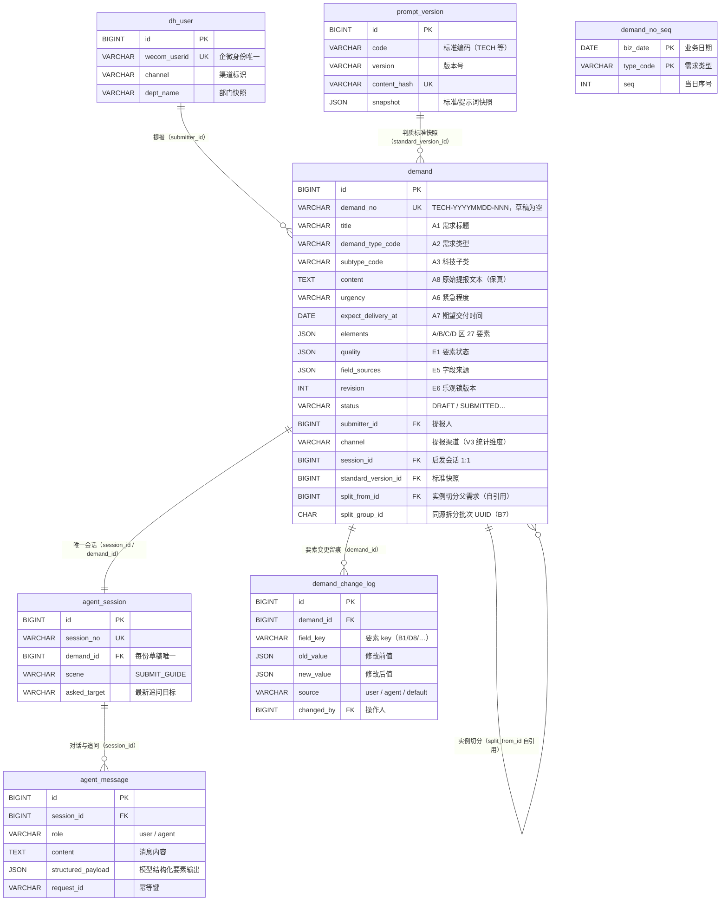

# DemandHub 科技需求收集智能体・概念模型与数据库设计方案

> 版本：v1.0 ｜ 日期：2026-10-06 ｜ 状态：待评审
> 依据：《DemandHub_科技需求收集智能体_BRD/MRD/PRD v1.3》（已确认）、《DemandHub_架构演进路线_v1.0》、Python 收集 MVP（
> `server/`
> ，PR #1）
> 范围：需求收集智能体的概念模型（实体 / 关系）与数据库逻辑 / 物理设计；承接 PRD §7「核心表扩展示意」，落到 MySQL DDL 级
> 原则：
> **按需建设、接缝清晰、e2e 门禁**
> （演进路线三原则）；字段命名统一
> **Snake Case**
> ；不与 Java 侧同库


***

## 1. 设计目标与约束


| # | 目标 / 约束                                                                                                     | 来源                    |
| - | ----------------------------------------------------------------------------------------------------------- | --------------------- |
| 1 | 五区标准需求要素表单（A 公共 / B 业务 / C 用户 / D 功能 / E 评估）完整落库，BA 可凭要素表单直接编写需求文档                                          | PRD §4                |
| 2 | 复用 Python MVP 现有 6 张表（dh\_user /prompt\_version/demand/demand\_no\_seq/agent\_session/agent\_message），不另起炉灶 | 演进路线 §1.2             |
| 3 | 要素标准由 YAML 配置驱动（tech.yaml），标准变更不引发数据迁移                                                                      | PRD §1.2「标准即配置」       |
| 4 | 支持草稿续报、对话中修改留痕、实例切分（一句话多个可独立受理需求）、同源关联（B6/B7 上游追踪）                                                          | FR-05/06/02、BR-T10/11 |
| 5 | 预算 / IRB 一期撤除，只留接缝不建实体                                                                                      | PRD §11.1             |
| 6 | 为 V2 流转权限、V3 统计预留无侵入的演进位                                                                                    | 演进路线 §4 V2/V3         |
| 7 | 全部字段下划线命名（Snake Case）；DDL 可直接执行                                                                             | 用户既定规范                |


***

## 2. 核心设计决策

### D1 要素值存储：JSON 内嵌 `demand.elements`，不建 EAV 元素表

**决策**：A/B/C/D 区要素以 `demand.elements` JSON 承载（分区对象），E 区评估状态沿用 `demand.quality` + `field_sources`，新增独立 `demand_change_log` 表。

**理由**（三选一论证）：


| 方案                                | 优点                                                                                        | 缺点                                                | 结论 |
| --------------------------------- | ----------------------------------------------------------------------------------------- | ------------------------------------------------- | -- |
| **A. JSON 内嵌（采纳）**                | 与「标准即配置」天然契合 ——YAML 增删要素只需改标准与写入逻辑，无 DDL；MVP 已验证（ext/quality JSON）；对齐 PRD §7 与 §12 Schema | 跨要素 SQL 查询需 JSON 函数                               | 采纳 |
| B. EAV 元素表（demand\_element 一行一要素） | 要素可建索引、可 SQL 直查                                                                           | 标准每次变更 = 数据迁移；27 要素 × 每需求 27 行，读写放大；与 YAML 配置驱动冲突 | 否决 |
| C. 全扁平列（27 列展开）                   | 查询直观                                                                                      | 大部分列可选、稀疏；YAML 增加要素（如预算 B5–B8）就要 ALTER            | 否决 |

> 决策锚点：演进路线 §2.4「按需建设 ——' 可能会要 ' 的只留接缝、不建实体」。要素体系是
> **配置域的活数据**
> ，不是关系域的稳定实体；关系域只固化「需求主记录、会话、消息、变更审计、编号流水」这些生命周期实体。

### D2 变更留痕（E7）：独立表 `demand_change_log`，不用 JSON 追加


* 理由：BRD 非功能「字段来源可审计」；对话中修改（FR-06）会产生高频变更，JSON 内嵌追加无法高效查询「谁在何时改了 B1」；V2 流转日志（demand\_transition\_log）同构，先立范式。

* 粒度：一条要素一次修改一行（old\_value /new\_value/source/changed\_by）。

### D3 实例切分（BR-T11）：`demand` 自引用两列，不建拆分表


* `split_from_id`：被哪条需求拆分而来（父）；`split_group_id`：同源批次 UUID（同组实例互相关联，支撑 B7 关联需求与需求追踪矩阵）。

* 父记录保留原始完整语义（`content` 即 A8 原文底稿），不生成编号，状态收尾 `CLOSED(close_reason='SPLIT')`；子记录独立编号、独立会话 / 追问队列。

* 一期 MVP 尚无切分，两列默认 NULL，零侵入。

### D4 追问历史（E8）：复用 `agent_message`，不建新表


* 每轮对话已落库（role/content/structured\_payload/request\_id），`asked_target` 在 agent\_session（最新目标）与 message payload（逐轮）双存；追问历史 = 按 session 查询 agent 消息中 `structured_payload.asked_target` 非空的记录及其后用户回复。零新增。

### D5 标准快照：复用 `prompt_version`


* `demand.standard_version_id` + `quality_content_hash` 已存在；YAML 标准升级 → 新 prompt\_version 快照，存量草稿 hash 不变则沿用旧判质结论，不做全量重判。

### D6 原文保真（BR-T12 / A8）：`demand.content` 承载原始文本，elements 只放提炼值


* `content` 永久保留用户原话（不润色、不增删事实）；`elements.B.businessBackground` 等为提炼值。二者并存，落实「A8 原文永久保留、来源留痕」。

### D7 预算 / IRB 接缝：不建列不建表


* 遵循「留接缝、不建实体」；启用路径见 §7.4—— 改 standards YAML + 状态机节点 + 前端追问序列，**无需 DDL**（elements 为 JSON 的天然红利）。

### D8 渠道：沿用配置化，`demand_channel` 表仅作 V2 接缝


* 现状：渠道在 config.py（channel\_entry\_auth\_mode /channel\_ls\_\*）+ auth API（channel-sso /channel-parameters）配置化；`dh_user.channel`、`demand.channel` 已落库。

* V3 统计「按渠道提报量 / 完成率」直接由 `demand.channel` 聚合，零成本；多渠道接入（WorkBuddy / 豆包）时如需要渠道 - 类型白名单参数审计化，再启用 `demand_channel` 表（§7.5）。


***

## 3. 概念模型

### 3.1 实体清单


| 实体      | 表                                       | 类型      | 说明                                 |
| ------- | --------------------------------------- | ------- | ---------------------------------- |
| 提报人     | `dh_user`                               | 已有      | 渠道回源用户（企微身份 → 内部用户）                |
| 需求 / 草稿 | `demand`                                | 已有 + 扩展 | 需求主记录：草稿→正式需求同表，status 区分          |
| 要素表单    | `demand.elements`（JSON）                 | 扩展      | A/B/C/D 区 27 要素值，配置驱动              |
| 要素评估    | `demand.quality` + `field_sources`      | 已有      | E1 各要素 OK/VAGUE/MISSING/SKIP；E5 来源 |
| 变更记录    | `demand_change_log`                     | **新增**  | E7 每次修改留痕                          |
| 启发会话    | `agent_session`                         | 已有      | 每份草稿唯一会话，含最新追问目标                   |
| 对话消息    | `agent_message`                         | 已有      | 全量对话 + 模型结构化输出 + 幂等（E8 追问历史）       |
| 标准快照    | `prompt_version`                        | 已有      | tech.yaml 等标准与提示词版本，不可变            |
| 编号流水    | `demand_no_seq`                         | 已有      | 按类型按日序号，保证编号唯一                     |
| 实例切分关系  | `demand.split_from_id / split_group_id` | 扩展      | 一句话多需求 → 同源实例组（BR-T11）             |

### 3.2 实体关系（ER）


```
dh_user ──< demand ──< demand_change_log
              │
              │ 1:1
        agent_session ──< agent_message
              │
              │ N:1（standard_version_id）
        prompt_version
              │
              │ 1:1
        demand_no_seq（biz_date+type_code 发放编号）
              │
              └── demand（自引用：split_from_id 父 / split_group_id 同源组）
```

### 3.3 E-R 实体图（Mermaid）

> 图一：
> **PNG 实体图（推荐，任何查看器均可预览）**
> —— 见下方
> `DemandHub_科技需求收集智能体_ER图.png`
> （与本文档同目录）。
> 图二：
> **Mermaid 源码（可维护版本）**
> —— 支持 Mermaid 的查看器（Typora / VS Code Markdown Preview / 飞书文档等）可直接渲染；两者内容一致。SVG 源文件（
>
> `DemandHub_科技需求收集智能体_ER图.svg`
>
> ）与 PNG 由 
>
> `scripts/gen_er_svg.py`
>
>  \+ 
>
> `scripts/svg_to_png.py`
>
>  同步维护。




> 关系说明：
> `demand_no_seq`
> 与
> `demand`
> 为逻辑关系（按
> `demand_no`
> 发放编号，无外键列）；
> `demand`
> 自引用为实例切分（BR-T11），
> `split_from_id`
> 指向父需求，同源组
> `split_group_id`
> 关联 B7。SVG 图与 Mermaid 源码由
> `scripts/gen_er_svg.py`
> 同步维护，改图请改脚本重跑。


* 提报人 1—N 需求（`submitter_id`）

* 需求 1—1 会话（`demand.session_id` / `agent_session.demand_id` 双向唯一）

* 会话 1—N 消息（`agent_session.id` → `agent_message.session_id`）

* 需求 N—1 标准快照（`demand.standard_version_id` → `prompt_version.id`）

* 需求 1—N 变更记录（`demand.id` → `demand_change_log.demand_id`）

* 需求 N—1 需求（自引用拆分：`demand.split_from_id` → `demand.id`；同源组 `split_group_id`）


***

## 4. 逻辑模型（字段字典）

### 4.1 `demand`（扩展后字段全集）

> 标注「已有」的字段不动；「新增」为本期扩展。


| 字段                                         | 类型                 | 空 | 说明                                                        | 状态     |
| ------------------------------------------ | ------------------ | - | --------------------------------------------------------- | ------ |
| id                                         | BIGINT PK          | 否 | 主键                                                        | 已有     |
| demand\_no                                 | VARCHAR(40) UNIQUE | 是 | 正式编号 TECH-YYYYMMDD-NNN；草稿为空                               | 已有     |
| title                                      | VARCHAR(256)       | 是 | A1 需求标题                                                   | 已有     |
| demand\_type\_code                         | VARCHAR(32)        | 是 | A2 需求类型（TECH/MATL/TRAIN）                                  | 已有     |
| subtype\_code                              | VARCHAR(32)        | 是 | A3 科技需求子类（SYS\_DEV/…）                                     | 已有     |
| content                                    | TEXT               | 是 | **A8 原始提报文本（永久保留，不润色）**                                   | 已有     |
| urgency                                    | VARCHAR(16)        | 否 | A6 紧急程度（NORMAL/URGENT/CRITICAL）                           | 已有     |
| expect\_delivery\_at                       | DATE               | 是 | A7 期望交付时间                                                 | 已有     |
| **elements**                               | **JSON**           | 是 | **A/B/C/D 区要素值（新增，权威要素区）**                                | **新增** |
| ext                                        | JSON               | 是 | 兼容层：MVP 旧字段 / 子类扩展，新写入进 elements                          | 已有     |
| quality                                    | JSON               | 是 | E1 各要素状态 \[ElementStatus]（OK/VAGUE/MISSING/SKIP+attempts） | 已有     |
| field\_sources                             | JSON               | 是 | E5 各要素来源 user/agent/default                               | 已有     |
| revision                                   | INT                | 否 | E6 版本号（乐观锁，每次修改递增）                                        | 已有     |
| client\_request\_id                        | VARCHAR(64)        | 否 | 幂等键（与 submitter\_id 唯一）                                   | 已有     |
| create\_request\_hash                      | VARCHAR(64)        | 否 | 创建请求指纹                                                    | 已有     |
| standard\_version\_id                      | BIGINT FK          | 是 | 判质所用标准快照                                                  | 已有     |
| quality\_content\_hash                     | VARCHAR(64)        | 是 | 判质内容指纹（标准变更不重判存量）                                         | 已有     |
| status                                     | VARCHAR(16)        | 否 | DRAFT/SUBMITTED…（12 态 V2 全量）                              | 已有     |
| submitter\_id                              | BIGINT FK          | 否 | 提报人 dh\_user.id                                           | 已有     |
| submitter\_name / submitter\_dept          | VARCHAR            | 是 | A4/A5 快照                                                  | 已有     |
| channel                                    | VARCHAR(32)        | 是 | 提报渠道（V3 统计维度）                                             | 已有     |
| session\_id                                | BIGINT UNIQUE      | 是 | 启发会话（1:1）                                                 | 已有     |
| **split\_from\_id**                        | **BIGINT FK**      | 是 | **实例切分父需求 id（BR-T11）**                                    | **新增** |
| **split\_group\_id**                       | **CHAR(36)**       | 是 | **同源拆分批次 UUID（B7 关联 / 追踪矩阵）**                             | **新增** |
| submitted\_at / closed\_at / close\_reason | DATETIME/VARCHAR   | 是 | 生命周期节点                                                    | 已有     |

**要素 JSON 结构（**`elements`**，对齐 PRD §12 Schema）**：


```
{
  "A": { "title": "渠道销量晨会报表", "demandTypeCode": "TECH", "techSubtype": "DATA_RPT",
         "requester": "刘泉", "dept": "网金业务部", "urgency": "URGENT",
         "expectDeliveryAt": "2026-11-01", "sourceTextRef": "content" },
  "B": { "businessGoal": "晨会前 8:00 自动产出各渠道销量", "businessBackground": "手工导出 40 分钟易错",
         "businessValue": "影响 15 人，每次节省 40 分钟", "stakeholders": ["网金运营", "财管科技产品部"],
         "businessRules": "", "upstreamGoal": "提升客户回访率至 80%", "relatedDemands": [] },
  "C": { "userRole": "网金业务部运营", "userGoal": "晨会前查看销量", "useScenario": "每个交易日晨会前查看各渠道销量",
         "useFrequency": "每个交易日", "painPoint": "手工拼 Excel 易错", "userCount": 15 },
  "D": { "functionDescription": "自动生成销量报表并推送企微群", "inputOutput": "输入：代销交易库；输出：销量报表",
         "businessRuleMap": "", "dataRequirements": "代销系统交易库 + 核心系统持仓",
         "interfaceRequirements": "", "nfrRequirements": ["3 秒内返回"], "exceptionHandling": "",
         "acceptanceCriteria": "每个交易日 8:00 前生成，与核心系统对账误差为 0" }
}
```

> 字段级规则（必填、到位标准、追问话术）全部由 standards YAML 驱动；
> `elements`
> 只存值，规则不落库（响应 D1）。

### 4.2 `demand_change_log`（新增表）


| 字段          | 类型                        | 空 | 说明                                       |
| ----------- | ------------------------- | - | ---------------------------------------- |
| id          | BIGINT PK AUTO\_INCREMENT | 否 | 主键                                       |
| demand\_id  | BIGINT FK → demand.id     | 否 | 需求 / 草稿                                  |
| field\_key  | VARCHAR(64)               | 否 | 要素 key（B1/D8/…），含 ext.\* 与 quality.\* 变更 |
| old\_value  | JSON                      | 是 | 修改前值（标量 / 数组 / 对象）                       |
| new\_value  | JSON                      | 是 | 修改后值                                     |
| source      | VARCHAR(16)               | 否 | user / agent / default                   |
| changed\_by | BIGINT FK → dh\_user.id   | 是 | 操作人（提报人）；Agent 写入为 NULL                  |
| created\_at | DATETIME(3)               | 否 | 留痕时间                                     |


* 索引：`(demand_id, created_at)`；无唯一约束（一条要素可多次变更）。

* 用途：FR-06 影响提示审计、BRD「字段来源可审计」、V2 流转日志同构范式。

### 4.3 复用表说明（零改动）


| 表                | 承担职责                                                                                                |
| ---------------- | --------------------------------------------------------------------------------------------------- |
| `agent_session`  | 每份草稿唯一会话；`asked_target` 为最新追问目标；`scene` 可扩（SUBMIT\_GUIDE 等）                                         |
| `agent_message`  | 全量对话 + `structured_payload`（模型要素抽取）+ `request_id/request_hash` 幂等 + token/latency 度量；**E8 追问历史即此表** |
| `prompt_version` | 标准 / 提示词不可变快照；`code`（如 TECH）+`version`+`content_hash`                                               |
| `demand_no_seq`  | 按 (biz\_date, type\_code) 发放编号，保证并存期编号唯一                                                            |
| `dh_user`        | 提报人 + 渠道身份（wecom\_userid 唯一）                                                                        |


***

## 5. 物理实现（MySQL DDL）

> 环境：MySQL 8.x（utf8mb4）；生产以 Alembic 迁移落地，以下 DDL 为等效 Schema 基准（Snake Case）。

### 5.1 `demand` 扩展（ALTER）


```
-- 科技需求收集智能体 V1.1：demand 表扩展
ALTER TABLE demand
  ADD COLUMN elements JSON NULL COMMENT 'A/B/C/D 区要素值（PRD 五区表单，标准配置驱动）' AFTER ext,
  ADD COLUMN split_from_id BIGINT NULL COMMENT '实例切分来源需求 id（BR-T11，NULL=独立需求）' AFTER session_id,
  ADD COLUMN split_group_id CHAR(36) NULL COMMENT '同源拆分批次 UUID（B7 关联需求/追踪矩阵）' AFTER split_from_id,
  ADD INDEX ix_demand_split_group (split_group_id),
  ADD INDEX ix_demand_split_from (split_from_id),
  ADD CONSTRAINT fk_demand_split_from FOREIGN KEY (split_from_id) REFERENCES demand(id);
```

### 5.2 `demand_change_log`（CREATE）


```
CREATE TABLE IF NOT EXISTS demand_change_log (
  id          BIGINT       NOT NULL AUTO_INCREMENT COMMENT '主键',
  demand_id   BIGINT       NOT NULL COMMENT '需求/草稿 id（demand.id）',
  field_key   VARCHAR(64)  NOT NULL COMMENT '要素 key：B1/D8/ext.techSubtype/quality.* 等',
  old_value   JSON         NULL COMMENT '修改前值',
  new_value   JSON         NULL COMMENT '修改后值',
  source      VARCHAR(16)  NOT NULL DEFAULT 'user' COMMENT '来源：user/agent/default',
  changed_by  BIGINT       NULL COMMENT '操作人 dh_user.id；Agent 写入为 NULL',
  created_at  DATETIME(3)  NOT NULL DEFAULT CURRENT_TIMESTAMP(3) COMMENT '留痕时间',
  PRIMARY KEY (id),
  KEY ix_change_demand_time (demand_id, created_at),
  CONSTRAINT fk_change_demand FOREIGN KEY (demand_id) REFERENCES demand(id),
  CONSTRAINT fk_change_user   FOREIGN KEY (changed_by) REFERENCES dh_user(id)
) ENGINE=InnoDB DEFAULT CHARSET=utf8mb4 COLLATE=utf8mb4_0900_ai_ci COMMENT='需求要素变更留痕（E7）';
```

### 5.3 索引与查询路径


| 场景              | 查询                                                 | 索引                                                 |
| --------------- | -------------------------------------------------- | -------------------------------------------------- |
| 我的需求列表（草稿 / 提交） | `WHERE submitter_id=? AND status=?`                | ix\_demand\_owner\_status（已有）                      |
| 管理员按类型筛         | `WHERE demand_type_code=? AND status=?`            | ix\_demand\_type\_status（已有）                       |
| 首页按提交时间         | `ORDER BY submitted_at DESC`                       | ix\_demand\_submitted（已有）                          |
| V3 按渠道统计        | `WHERE channel=? AND submitted_at BETWEEN ? AND ?` | 新增 ix\_channel\_submitted (channel, submitted\_at) |
| 实例切分同源组         | `WHERE split_group_id=?`                           | ix\_demand\_split\_group（新增）                       |
| 拆分父子回溯          | `WHERE split_from_id=?` / `id=?`                   | ix\_demand\_split\_from（新增）                        |
| 变更审计            | `WHERE demand_id=? ORDER BY created_at`            | ix\_change\_demand\_time（新增）                       |

> 说明：跨要素的统计类查询（如「有多少需求带了验收标准」）一期用
> `JSON_EXTRACT(elements,'$.D.acceptanceCriteria')`
> 过滤即可，量级（内网几十用户、年需求数百条）无需物化列；V3 若出现高频多维统计，再建统计宽表（demand_stat_daily 口径延伸，见 §7.3），不在业务表上开洞。


***

## 6. 与 MVP 现状的映射与迁移

### 6.1 字段映射（tech.yaml 六要素 → 五区表单）


| MVP 现状                                                                                 | 新模型                                   | 处理                                                                                       |
| -------------------------------------------------------------------------------------- | ------------------------------------- | ---------------------------------------------------------------------------------------- |
| demand.content                                                                         | A8 原文 + elements.B.businessBackground | content 继续保真原文；背景提炼进 elements                                                            |
| demand.ext（techSubtype/businessScenario/acceptanceCriteria/valueImpact/relatedSystem…） | elements.A/C/D/B 对应区                  | **存量读 ext、新写入 elements**；标准 YAML 的 field\_path 改为 elements 路径后，merge\_structured 自然写入新结构 |
| demand.quality（\[ElementStatus]）                                                       | E1 elementStatus                      | 继续使用（含 attempts 轮次计数）                                                                    |
| demand.field\_sources                                                                  | E5                                    | 继续使用                                                                                     |
| demand.revision                                                                        | E6                                    | 继续使用（乐观锁）                                                                                |
| prompt\_version.standard\_version\_id                                                  | E 区判质版本                               | 继续使用                                                                                     |
| —                                                                                      | E7 changeLog                          | 新增 demand\_change\_log 表                                                                 |
| —                                                                                      | E8 askHistory                         | agent\_message 天然承载                                                                      |

### 6.2 迁移策略（最小侵入）


1. **双写过渡**：新会话的模型输出写入 `elements` 的同时保留 `ext` 兼容副本（一版），代码回归后去掉 ext 写入；

2. **存量数据**：已有草稿 / 需求（ext 结构）读取时按 §4.4 映射渲染，无需数据回填 —— 量小且收集段数据生命周期短；

3. **Alembic**：新增 0002\_revision（elements/split\_from\_id/split\_group\_id + demand\_change\_log），与 0001\_init 同库同链路；

4. **门禁**：既有 e2e（scripts/e2e\_mvp.py）+ 新增变更留痕 / 切分字段用例全绿为验收。


***

## 7. 演进预留接缝（不建实体，只留路径）

### 7.1 V2 流转与权限（触发：分派 / 进度诉求）


* 12 态状态机在 `demand.status` 上扩展（现有 DRAFT/SUBMITTED 已占位）；

* 新增 `demand_transition_log`（demand\_id /from\_status/to\_status/operator/comment/created\_at），与 demand\_change\_log 同构，照抄范式即可。

### 7.2 V3 运营能力（触发：通知 / 报表诉求）


* 通知：DB 信箱表 + 定时任务（演进路线降级方案）；

* 统计：`demand_stat_daily`（Java 蓝本口径移植）+ `channel` 维度直接聚合，需求：`demand.channel` 已落库。

### 7.3 多渠道（触发：WorkBuddy / 豆包接入）


* 渠道适配层不动库；`dh_user.channel` + `demand.channel` 已支持多渠道草稿互通；

* 需要渠道 - 类型白名单参数审计化时，启用 `demand_channel` 表（channel\_code /allowed\_types JSON /params/enabled），现为 config.py + 接口层承载。

### 7.4 预算 / IRB 接缝（PRD §11.1，一期撤除）


* **启用无需 DDL**：① standards/tech.yaml 恢复 B 区 B5–B8（budgetStatus/budgetAmount/outOfBudgetApplied/irbReminder）→ 自动落入 `elements.B`；② 会话状态机加 BUDGET\_CHECK 节点；③ 追问序列话术配置化；④ 提醒留痕可直接写 `demand_change_log`（field\_key='B5.budgetStatus'）或 elements 内嵌 —— 接缝在配置层，数据层零改动。

### 7.5 实例切分与需求追踪矩阵（B6/B7）


* B6 上游业务目标 = `elements.B.upstreamGoal`（大战略拆条回溯锚点）；

* B7 关联需求 = `split_group_id` 同组查询 + 用户手工关联时写入 `elements.B.relatedDemands`（编号列表）；

* 追踪矩阵（Wiegers）落地：`demand_no` ↔ `upstreamGoal` ↔ `split_group_id` 三键即可回溯，无需新表。


***

## 8. 风险与边界


| 风险                    | 缓解                                   |
| --------------------- | ------------------------------------ |
| JSON 要素查询能力受限         | 一期量级无碍；V3 统计走独立聚合表，不在业务表上开洞          |
| ext 与 elements 双写期不一致 | 短过渡窗口 + 回归用例；过渡后 ext 只读              |
| 实例切分后并发编辑冲突           | 各实例独立 demand 行 + revision 乐观锁天然隔离    |
| 标准升级影响存量判质            | quality\_content\_hash 不变不重判，快照版本可追溯 |
| 变更日志增长                | 每需求年变更量级极小（百条内），无归档压力；V2 可加分区        |


***

## 9. 版本记录


| 版本   | 日期         | 变更                                                         | 作者      |
| ---- | ---------- | ---------------------------------------------------------- | ------- |
| v1.0 | 2026-10-06 | 初稿：概念模型 + 数据库设计方案（elements JSON /change\_log/ 实例切分两列 / 接缝） | 财管科技产品部 |
| v1.1 | 2026-10-06 | 增补：§3.3 E-R 实体图（Mermaid erDiagram，含实体属性与关系基数）              | 财管科技产品部 |