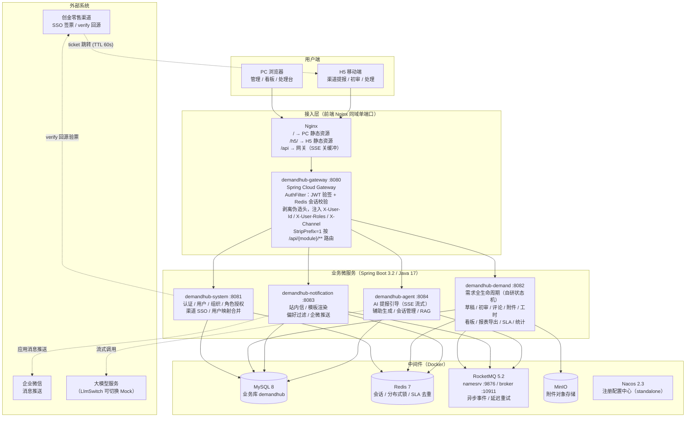
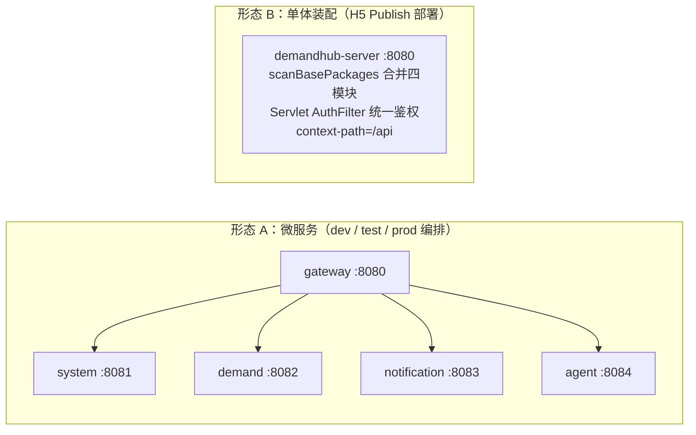

# DemandHub 系统架构（现状）

> 版本：v1.0（基于当前代码整理）
> 技术栈：Java 17 / Spring Boot 3.2 / Spring Cloud Gateway / MyBatis-Plus / Vue 3 / RocketMQ 5.2 / MySQL 8 / Redis 7 / MinIO

---

## 1. 系统总体架构图



---

## 2. 后端模块结构

Maven 多模块（`backend/pom.xml`），7 个模块：

| 模块 | 职责 | 核心组件 |
|---|---|---|
| **demandhub-common** | 公共基础 | `Result`/`ErrorCode` 统一响应体；`UserContextFilter`（只信网关注入头）；`@RequireRole` + AOP；`DataScopeInterceptor`（MyBatis 拦截器，自动过滤 demand SELECT）；`AuditMetaObjectHandler`（自动填充 created_by/updated_by）；`GlobalExceptionHandler`（HTTP 200 + body `{code,message,data}`） |
| **demandhub-system** | 系统管理 | `AuthController`（PC 账密登录 / refresh / logout / me）；渠道 SSO：`ChuangjinLsSsoClient`、`ChannelSsoTicketVerifier`（env 三件套优先于 `demand_channel.config_json`）、`SecretCrypto`（AES-GCM）；`ChannelUserMatcher` / `UserMergeService`（渠道用户映射合并）；`OrgService`（物化路径子树匹配）；`RoleGrantService`（角色族 + demand_type_scope + org 范围） |
| **demandhub-demand** | 需求核心 | 自研轻量状态机 `DemandStateMachine`（`state_machine_config` 表驱动、支持热加载）；`DemandNoGenerator`（Redis 锁 + DB 乐观锁，TECH/MATL/TRAIN-YYYYMMDD-NNN 无空洞）；`DemandEventRelay`（事务提交后 Spring 事件 → RocketMQ）；`SlaScanJob`（30s 扫描 + Redis 去重告警）；`StatDailyJob`（5min 增量聚合 `demand_stat_daily`）；`ReportExportExecutor`（POI 异步导出）；类型扩展表 tech/material/training |
| **demandhub-notification** | 通知中心 | `DemandEventConsumer` 订阅需求事件 → `TemplateService`（`${demand_no}` 变量渲染）→ `PreferenceService`（用户可关非关键通知）→ `RecipientResolver` → 站内信落库 + `WecomPushProducer/Consumer`（延迟队列指数退避，最多 5 次） |
| **demandhub-agent** | AI 助手 | `AgentGuideController`（SSE 流式提报引导）；`LlmSwitch`（Mock / 真实 LLM 切换）；`RagService` + `RagVectorizeConsumer`（MQ 异步向量化）；`PromptTemplateService` |
| **demandhub-gateway** | 网关 | Spring Cloud Gateway；`AuthFilter`：JWT 验签 + Redis 会话存在性校验；剥离客户端伪造用户头，注入 `X-User-Id` / `X-User-Uid` / `X-User-Roles` / `X-Channel`；CORS；按路径路由四模块 |
| **demandhub-server** | 单体装配 | 合并四业务模块为单进程（H5 Publish 部署形态）；Servlet 版 `AuthFilter` 承担统一鉴权；`context-path=/api` 与微服务形态路径完全一致，nginx / 前端 / e2e 零改动 |

## 3. 两种部署形态（代码同构）



## 4. 环境拓扑

| 环境 | 编排文件 | 关键端口（宿主） | 说明 |
|---|---|---|---|
| dev 中间件 | `deploy/docker-compose.yml`（demandhub-infra，6 容器） | MySQL 3307 / Redis 6379 / MinIO 9000·9001 / Nacos 8848·9848 / RocketMQ 9876·10909·10911 | 业务模块本地 IDE 启动：网关 8080、system 8081、demand 8082、notification 8083、agent 8084 |
| test | `deploy/docker-compose.test.yml`（demandhub-test，13 容器） | Nginx 8088（同域）/ 网关 8180 / MySQL 3317 / Redis 6380 / MinIO 9010·9011 / Nacos 8858 / 契约 Mock 8099 | `CHANNEL_SSO_MOCK=false`，verify 回源走契约 Mock（严格验签）；e2e 用 |
| prod | `deploy/docker-compose.prod.yml`（demandhub-prod） | Nginx 80 / 网关 8080 | `CHANNEL_SSO_MOCK=false` 强制；`SECRET_STORE_KEY` / `CHANNEL_LS_*` env 注入（`:?` 缺失即拒启） |

## 5. 核心链路

### 5.1 渠道 SSO 登录（H5）

```
创金零售 App → https://host/h5/report?from=chuangjinls&ticket=xxx（TTL 60s，URL 只带 ticket）
  → GET /api/system/auth/channel-sso（白名单）
  → ChannelSsoTicketVerifier 验签 → verify 回源渠道换取身份
  → 渠道用户映射 / 合并（ChannelUserMatcher / UserMergeService）
  → 签发 JWT（access 2h / refresh 8h）+ Redis 会话（auth:session:{jti}）
  → 后续请求：AuthFilter 验签 + Redis 会话校验 → 注入用户头（X-Channel 来自会话，不信前端）
```

### 5.2 需求流转与通知（异步解耦）

```
提报 / 流转操作 → DemandStateMachine.transition()（配置表校验）
  → 同事务：demand 更新 + demand_transition_log 落库 + 发布 DemandTransitionEvent（Spring）
  → AFTER_COMMIT：DemandEventRelay → RocketMQ DEMAND_EVENT_TOPIC（失败只告警不阻塞主流程）
  → notification 消费：模板渲染 → 偏好过滤 → 站内信落库 + 企微 MQ 推送（延迟重试 ≤ 5 次）
```

### 5.3 AI 提报引导（SSE）

```
PC / H5 → /api/agent/guide/**（SSE，Nginx proxy_buffering off）
  → AgentGuideService → LlmSwitch（Mock / 真实 LLM）
  → 流式输出 → 解析结果回填表单（高亮 + 角标）→ 缺失要素逐项追问
```

## 6. 安全与横切约束

- **统一鉴权**：真实 401 只来自 AuthFilter（网关 / 单体 Servlet 版）；业务接口异常一律 HTTP 200 + `{code,message,data}`
- **头信任边界**：业务模块只信网关注入的 `X-User-*` / `X-Channel`；绕过网关直连 8081~8084 返回 401
- **数据权限**：`DataScopeInterceptor` 按角色族（ADMIN / EXECUTIVE / MANAGER / HANDLER）+ `demand_type_scope` + org 物化路径子树自动过滤查询
- **并发安全**：需求认领 = Redis 分布式锁 + DB 乐观锁双保险；需求单号并发无空洞
- **密钥管理**：`SECRET_STORE_KEY`（渠道配置 ENC: 密文 AES-GCM 主密钥）、`CHANNEL_LS_*` 一律 env 注入，不落库、不入仓库
