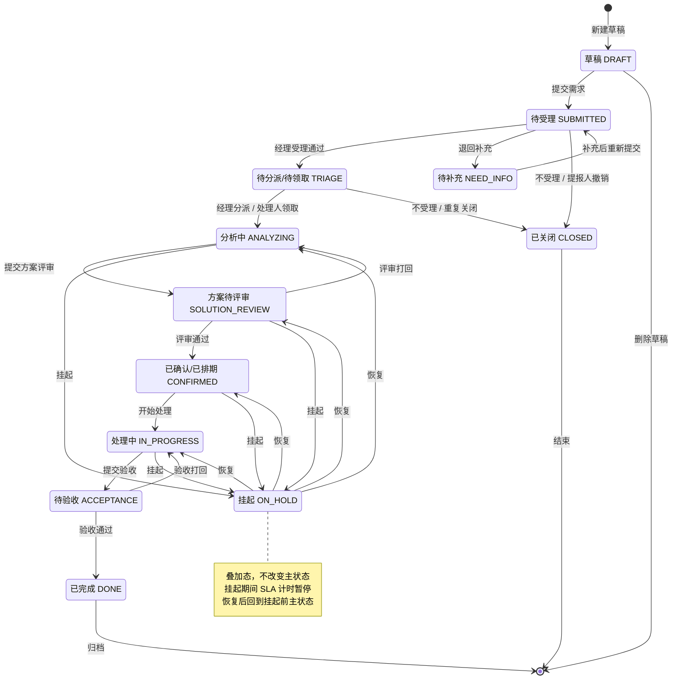

# DemandHub 零售业务线需求管理系统 · 系统需求规格说明书（SRS）

| 项目 | 内容 |
|---|---|
| 文档名称 | DemandHub 系统需求规格说明书（Software Requirements Specification） |
| 版本 | v1.4 |
| 所属公司 | 创金合信基金管理有限公司 |
| 业务线 | 零售业务线 |
| 编制部门 | 财管科技产品部 |
| 编制日期 | 2026-09-19 |
| 文档状态 | 已按创金零售 SSO 票据嵌入方案修订 v1.4 |
| 上游文档 | 《业务需求说明书 BRD v1.2》《概念模型 v1.2》《科技需求流程与状态机 v0.1》 |

---

## 1. 引言

### 1.1 目的

本文档把业务需求说明书（BRD）中的业务需求转化为**可设计、可开发、可测试、可验收**的系统需求规格，是架构设计、数据库设计、原型设计、开发与测试的直接依据。

### 1.2 读者

架构师、开发工程师、测试工程师、产品经理、UI/UX、运维、业务验收人。

### 1.3 需求编号约定

- **FR-xx-yy**：Functional Requirement，模块编号 + 序号。
- **NFR-xx**：Non-Functional Requirement。
- **DR-xx**：Data Requirement。
- **IR-xx**：Interface Requirement。
- 每个 FR 必须可测试，含前置条件、主流程、异常流、验收标准。

### 1.4 术语与缩写

沿用 BRD 第 11 节。补充：

| 缩写 | 含义 |
|---|---|
| SSO | 单点登录 |
| RBAC | 基于角色的访问控制 |
| RACI | 负责/批准/咨询/知会 |
| SLA | 服务水平协议 |
| IDP | 身份提供方（统一权限中心） |

---

## 2. 总体描述

### 2.1 产品定位

DemandHub 是创金合信基金零售业务线内部的需求全生命周期管理平台，承载提报、受理、分派、处理、方案、评审、验收、盘点、复盘的数据闭环，并内嵌 AI Agent 辅助提报与处理。

### 2.2 用户类

| 用户类 | 描述 | 典型使用频率 |
|---|---|---|
| 需求提报人 | 一线展业人员为主，中台同事亦可代办 | 周级 |
| 需求处理人员 | 承接部门成员 | 日级 |
| 需求经理 | 承接部门/小组负责人 | 日级 |
| 需求管理者 | 零售线分管领导 | 周/月级 |
| 系统管理员 | 财管科技产品部运维 | 月级 |

### 2.3 运行环境

- **服务端**：公司内网私有化部署，Linux（CentOS/麒麟），容器化（Docker + Kubernetes）。
- **客户端**：
  - PC：主流 Chrome/Edge 最新两个大版本，用于经理分派、管理者盘点、系统管理。
  - 移动：企业微信内置浏览器（H5），适配 iOS/Android；**一线提报/待办/验收主体验在企微手机端**。
  - 嵌入：从"创金零售"企微应用路由跳转到 DemandHub H5 提报页。
- **身份**：DemandHub 拥有自有用户体系（OneID），**不注册独立企微应用、不持有企微密钥**；H5 从"创金零售"企微应用路由跳转进入，由创金零售利用其企微登录态签发一次性 SSO 票据，DemandHub 服务端回源校验后免登（详见《H5 嵌入方案与对接标准 v2.0》）；PC 管理端使用账号密码登录；飞书机器人、豆包工作、WorkBuddy 等渠道预留。
- **浏览器兼容**：Chrome 120+、Edge 120+、企微内置浏览器（基于 Chromium）。

### 2.4 设计约束

- 必须私有化部署，数据不出公司内网。
- **不注册独立企微应用、不持有企微应用密钥**：H5 嵌入登录经创金零售 SSO 票据回源校验完成；企微应用消息推送、机器人提报均列为二期。
- PC 管理端使用账号密码登录（BCrypt、失败锁定、审计）；H5 不开放密码登录。
- **DemandHub 必须拥有自有用户表与组织树**，管理员可在后台维护；各提报渠道自行鉴权，DemandHub 不直接对接各渠道权限中心。
- 一期采用**路由跳转**方式从"创金零售"进入 DemandHub，不要求对方前端排期做组件合并。
- 前端不允许直连数据库，必须经后端 API 网关。

---

## 3. 功能需求

### 3.1 模块总览

| 模块编号 | 模块 | 说明 |
|---|---|---|
| M1 | 认证与业务权限 | 创金零售 SSO 票据登录（H5）、PC 账号密码登录、渠道用户自动匹配（手机号/企微userid）、新用户自动开通与待完善、用户合并、组织树维护、业务角色按类型授权、数据范围过滤 |
| M2 | 需求提报 | 表单、Agent 启发、草稿、附件、代办提报 |
| M3 | 需求受理与分派 | 路由、分诊、退回、关闭、分派/领取 |
| M4 | 需求处理协作 | 方案多版本、评审、评论、子需求、工时、挂起 |
| M5 | 验收与归档 | 验收、质量评分、归档 |
| M6 | 全局盘点与看板 | 管理者视图、经理视图、SLA 预警、报表 |
| M7 | 通知中心 | 一期站内信与 H5 红点、消息模板；企微应用消息二期（创金零售代发或独立应用） |
| M8 | 系统管理 | 类型字典、状态机配置、通知模板、字典 |
| M9 | AI Agent 服务 | 提报启发、调研问题、方案辅助、SOP 检索 |

---

### 3.2 M1 认证与业务权限

> 设计原则：**DemandHub 自有用户体系（OneID）与组织树；各提报渠道自行鉴权，回调时带用户信息，经映射表匹配到 OneID；业务角色按需求类型细分本地授权**。

#### FR-M1-01 多渠道回调登录与用户匹配
- **支持的登录渠道**：
  - 创金零售企微应用（一期 H5 主入口）：路由跳转进入，创金零售签发一次性 SSO 票据，DemandHub 回源校验后静默免登
  - PC 管理端：账号密码登录（仅管理/经理/处理角色）
  - 企微机器人、飞书机器人、豆包工作、WorkBuddy（预留，一期不实际对接）
- **用户自动匹配流程**：
  1. 渠道回调带回 channel_code + channel_user_id + 姓名 + 手机号 + 部门（可空）；
  2. 按优先级自动匹配 DemandHub OneID：**手机号精确匹配 > 企微 userid 匹配**；
  3. 命中已有 OneID → 自动建 channel_user_mapping 记录，零人工介入；
  4. 未命中 → 创金零售票据校验通过且带回企微 userid 的，自动建 demand_user（status=ACTIVE、is_employee=1，按 dept_id 映射组织，未映射挂"未分配组织"虚拟节点），可立即提报；仅当票据身份字段缺失（无 userid 且无手机号）或外部渠道用户时才建 PENDING 账号，进入管理员"待完善"队列。
- **验收**：同一员工多次从创金零售入口进入识别为同一 OneID；全新企微 userid 首次进入自动建 ACTIVE 账号并可直接提报，无需管理员预先开通。

#### FR-M1-02 新用户待完善与用户合并
- 管理员后台"待完善用户"队列展示 status=PENDING 的用户，字段：渠道来源、渠道姓名、手机号、首次登录时间。
- 管理员操作：
  - 判定是否员工：是 → 选择组织树节点、标记 is_employee=1、补全工号；否 → 保留外部组织；
  - 授予业务角色（仅员工可授经理/处理人）；
  - 确认后 status → ACTIVE。
- **用户合并**：管理员发现新完善用户与已有 OneID 重复时，执行"合并到已有用户"：
  - 原用户所有需求、评论、工时、分派、渠道映射迁移到目标 OneID；
  - 原用户 status=MERGED，merged_to_user_id 指向目标；
  - 合并操作留日志（操作人、时间、原因）。
- **验收**：合并后原用户登录自动跳到目标 OneID 视图；原用户名下数据全部归并。

#### FR-M1-03 组织树维护
- 管理员在后台维护 demand_org 组织树：新增/编辑/停用节点、调整层级（拖拽）、设置 org_kind（提报组织/承接组织）。
- 创金零售渠道回调带的部门名用于初始化组织树与日常匹配校准。
- **验收**：部门拆分/合并后，调整组织树节点即可，不改流程配置；提报人历史需求的组织快照不变。

#### FR-M1-04 业务角色授权（按类型细分）
- 业务角色类型：
  - ADMIN（系统管理员）
  - EXECUTIVE（需求管理者，零售线领导）
  - TECH_MANAGER / MATL_MANAGER / TRAIN_MANAGER（科技/物料/培训需求经理）
  - TECH_HANDLER / MATL_HANDLER / TRAIN_HANDLER（科技/物料/培训需求处理人）
- 不设"需求提报人"角色——任何登录用户默认可提报。
- 管理员授权时指定：用户（demand_user.id）、角色、授权组织范围（组织子树）、生效起止时间。
- 仅 is_employee=1 的用户可授 HANDLER/MANAGER 类角色；外部用户（is_employee=0）不可。
- **验收**：一个用户可同时具备多个类型角色；调整授权后 1 分钟内生效。

#### FR-M1-05 数据权限过滤
- 列表与详情查询自动追加数据范围过滤，前端不可绕过。
- 普通用户：仅看本人提报 + 被代办提报 + 被分派/领取的需求。
- 类型经理：看本承接组织子树作为该类型承接方的需求。
- 需求管理者：看全零售线。
- 系统管理员：仅配置数据，不参与业务流。
- **验收**：用 A 部门处理人账号登录，绝不可见 B 部门处理人未分派的需求池；外部用户看不到处理工作台。

#### FR-M1-06 从"创金零售"路由跳转
- 在"创金零售"企微应用首页功能区新增"需求提报"入口，点击后由创金零售后端签发一次性 ticket 并 302 跳转到 `https://{demandhub}/h5/report?from=chuangjinls&ticket={ticket}`（契约见对接标准 v2.0）。
- DemandHub 手机端提报页视觉风格与"创金零售"保持一致：深蓝头部（约 `#1a3a6b`）、白色圆角卡片、左文右数列表。
- **验收**：在"创金零售"点击入口后 ≤ 2 秒进入 DemandHub 提报页；手机端页面在 390–430px 宽度下排版正常。

---

### 3.3 M2 需求提报

#### FR-M2-01 提报表单
- 提报人选择需求类型（科技/物料/培训/未分类），系统按类型动态渲染字段。
- 公共字段：标题、需求类型、需求内容、紧急程度（普通/紧急/特急）、期望交付时间、附件、@协办人。
- 科技需求扩展字段：子类（系统开发/数据报表/系统集成/运维优化/其他）、关联系统/模块、业务场景、验收标准。
- 物料需求扩展字段：子类、用途/场景、数量、期望到位时间。
- 培训需求扩展字段：子类、培训对象、人数、期望完成时间。
- **验收**：切换类型时表单字段正确切换，不串字段。

#### FR-M2-02 Agent 启发式引导
- 提报人输入一句话诉求，Agent 多轮追问，自动补齐公共字段与扩展字段。
- Agent 实时校验必填项，输出结构化草稿。
- 支持语音输入（企微语音消息自动转写）。
- **验收**：Agent 至少能引导出"业务背景、使用场景、期望效果、紧急程度"四要素；缺失时显式提示。

#### FR-M2-03 草稿暂存
- 未提交的需求自动保存为草稿（DRAFT），可多次打开编辑。
- 草稿对其他人不可见。
- 提交后草稿转为正式需求。
- **验收**：刷新页面/中途退出后草稿不丢失。

#### FR-M2-04 附件
- 支持上传图片、PDF、Office 文档、压缩包，单文件 ≤ 50MB，单需求 ≤ 20 个附件。
- 附件需记录：文件名、大小、MIME、上传人、上传时间、业务类型、业务 ID。
- 语音附件自动转写为文本。
- **验收**：上传失败有明确错误提示；附件可下载、预览（图片/PDF）。

#### FR-M2-05 代办提报
- 提报人可为他人代办提报，填写"实际需求人"。
- 系统同时记录代办人与实际需求人。
- 通知默认发给实际需求人，副本给代办人。
- **验收**：列表与详情可区分"我代提的"与"我本人提的"。

#### FR-M2-06 提报提交与编号
- 提交后系统自动生成编号：`{TYPE}-{YYYYMMDD}-{NNN}`，例 `TECH-20260919-001`。
- 状态置为 SUBMITTED（待受理）。
- 按类型路由到默认承接组织，通知该组织需求经理。
- **验收**：编号全局唯一、按日流水递增；重复并发提交不产生重复编号。

#### FR-M2-07 提报人撤销
- 在状态为 SUBMITTED（待受理）时，提报人可撤销，状态变为 CLOSED，原因必填。
- 一旦经理已受理（进入 TRIAGE 及以后），不可撤销。
- **验收**：撤销操作写流转日志并通知经理。

---

### 3.4 M3 需求受理与分派

#### FR-M3-01 经理受理工作台
- 需求经理看到本承接组织"待受理"队列，支持按紧急程度、提交时间、提报部门排序筛选。
- 受理动作：查看详情 → 选择"受理 / 退回补充 / 关闭"。
- **验收**：经理未处理的待受理需求在工作台首屏可见并计数。

#### FR-M3-02 退回补充
- 经理可退回并填写补充说明。
- 状态变为 NEED_INFO，通知提报人。
- 提报人补充后重新提交，回到 SUBMITTED。
- **验收**：退回原因必填；补充提交后重新进入经理队列。

#### FR-M3-03 不受理/重复关闭
- 经理可关闭需求，关闭原因必填（不受理/重复/其他），重复时可关联原需求。
- 状态变为 CLOSED，通知提报人。
- **验收**：关闭操作留痕；关闭后不可再打开，只能新建。

#### FR-M3-04 类型修正
- 仅需求管理者可修正需求类型。
- 修正后系统重新路由到新类型的默认承接组织。
- 全程写流转日志（原类型 → 新类型）。
- **验收**：普通经理无此按钮；修正后通知新承接组织经理。

#### FR-M3-05 进入需求池
- 经理受理通过后，状态变为 TRIAGE（待分派/待领取）。
- 需求池对该承接组织的处理人员可见。
- **验收**：需求池按紧急程度、停留时长排序；停留超 SLA 阈值高亮。

#### FR-M3-06 经理分派
- 经理在需求池中指定处理人。
- 分派后状态变为 ANALYZING，通知被分派人。
- **验收**：分派动作写日志；被分派人收到企微卡片消息，点击直达需求详情。

#### FR-M3-07 处理人领取
- 处理人可在本组织需求池领取需求。
- 领取后状态变为 ANALYZING，记录领取人。
- 并发领取需加锁，先抢先得。
- **验收**：两人同时点击领取，仅一人成功，另一人提示"已被领取"。

---

### 3.5 M4 需求处理协作

#### FR-M4-01 需求分析
- 处理人进入 ANALYZING 后，可记录分析纪要、@相关人、上传调研附件。
- Agent 辅助：基于历史相似需求生成调研问题清单。
- **验收**：分析纪要可追加修改，历史版本可追溯。

#### FR-M4-02 方案多版本
- 处理人可撰写方案（Solution），支持多版本。
- 字段：版本号、方案内容、需求规约、计划交付时间、备注、状态（草稿/待评审/已确认）。
- 提交评审后状态变为 SOLUTION_REVIEW。
- **验收**：新旧版本可对比；每次提交评审生成新版本号。

#### FR-M4-03 方案评审
- 评审人：需求经理（必选）、提报人（可选知会）、相关方（可选）。
- 评审结论：通过 / 打回（附意见）。
  - 通过 → 状态 CONFIRMED，落计划交付时间，通知提报人。
  - 打回 → 回到 ANALYZING，附意见。
- **验收**：评审动作写日志；打回意见在详情页高亮展示。

#### FR-M4-04 执行落地
- 状态 CONFIRMED 后，处理人可"开始处理"，进入 IN_PROGRESS。
- 支持：拆分子需求（父子关联）、关联项目、填报工时。
- **验收**：子需求独立编号、独立状态；父需求自动汇总子需求进度。

#### FR-M4-05 工时记录
- 处理人可按日填报工时（小时数 + 工作说明 + 日期）。
- 工时挂在需求下，可按人/按周/按月汇总。
- **验收**：工时数据用于经理工作量复盘；不可修改已完成需求的历史工时（仅可追加更正并留痕）。

#### FR-M4-06 挂起与恢复
- 任意在途状态（ANALYZING/SOLUTION_REVIEW/CONFIRMED/IN_PROGRESS）可挂起。
- 挂起必填原因，记录挂起时间。
- 挂起期间 SLA 计时暂停。
- 恢复后回到挂起前主状态。
- **验收**：详情页显示"已挂起 X 天，原因：xxx"；SLA 剩余时间不因挂起流逝。

#### FR-M4-07 评论与沟通
- 需求详情页内置评论区，支持文字、附件、@人。
- 被 @ 的人收到企微通知。
- 评论不可删除，仅可追加补充。
- **验收**：评论按时间线排列；附件可随评论一起上传。

#### FR-M4-08 需求关联
- 一个需求可关联其他需求：父子、依赖、重复、拆分。
- 关联关系双向可见。
- **验收**：关联列表在详情页展示，点击可跳转。

---

### 3.6 M5 验收与归档

#### FR-M5-01 提交验收
- 处理人完成后点击"提交验收"，状态变为 ACCEPTANCE。
- 通知提报人。
- **验收**：提交验收时系统校验必填（方案已确认、工时已填、交付物已上传）。

#### FR-M5-02 验收通过
- 提报人确认交付物，填写：完成质量评分（1–5 星）、满意度评分（1–5 星）、验收意见。
- 状态变为 DONE，归档实际交付时间。
- 通知所有相关人。
- **验收**：DONE 后核心字段只读；评分进入复盘数据。

#### FR-M5-03 验收不通过
- 提报人填意见打回，状态回到 IN_PROGRESS。
- 通知处理人与经理。
- **验收**：打回次数计入质量指标（同一需求打回 ≥ 2 次自动提示经理关注）。

---

### 3.7 M6 全局盘点与看板

#### FR-M6-01 管理者看板
- 顶部 KPI 卡片：本月新增、在途、已完成、超 SLA 数、平均交付周期。
- 维度：按需求类型、按承接组织、按提报组织、按状态。
- 图表：趋势（近 12 周）、类型分布饼图、组织积压 Top N、SLA 健康度。
- 支持时间范围筛选（本周/本月/本季/自定义）。
- **验收**：看板数据与列表数据一致；刷新延迟 ≤ 5 分钟。

#### FR-M6-02 经理看板
- 本承接组织：待受理数、池中数、处理中数、本团队人均在途数、本周完成数。
- 团队成员工作量分布（人 × 在途需求数 × 工时）。
- **验收**：经理仅看到本组织数据。

#### FR-M6-03 SLA 预警
- 按需求类型配置 SLA：各状态最长停留时长。
- 即将超时（剩余 < 20%）黄色高亮，已超时红色高亮。
- 超 SLA 自动通知经理与需求管理者。
- 挂起期间不计入 SLA。
- **验收**：用测试需求把 SLA 配成 1 分钟，可观察到超时告警。

#### FR-M6-04 复盘报表
- 月度/季度自动生成：完成率、平均交付周期、打回率、满意度平均分、Top N 提报部门、Top N 积压组织。
- 支持导出 Excel。
- **验收**：报表口径与 BRD 成功度量指标一致。

---

### 3.8 M7 通知中心

#### FR-M7-01 站内信
- 系统消息中心按"未读/已读"管理。
- 消息类型：待办提醒、状态变更、@我、分派、评审请求、验收请求、SLA 告警。
- 点击消息直达需求详情。
- **验收**：未读数实时更新；已读/未读状态正确。

#### FR-M7-02 消息触达（一期站内信，企微消息二期）
- 一期关键节点写站内信并在 H5 待办/消息中心红点提醒（提交、分派、领取、退回、评审、排期、提交验收、验收完成、SLA 告警）。
- 二期企微应用消息（卡片形式，含标题、摘要、直达链接）：因 DemandHub 无独立企微应用，需通过创金零售代发接口或申请独立应用实现，对接标准 v2.0 已预留代发接口。
- **验收（一期）**：状态变更后站内信 ≤ 1 分钟可达、H5 红点正确；二期企微消息卡片点击在企微内打开 H5 详情。

#### FR-M7-03 通知偏好
- 用户可在个人设置中关闭非关键通知（如 @我 之外的状态变更），但待办提醒不可关闭。
- **验收**：偏好设置即时生效。

---

### 3.9 M8 系统管理

#### FR-M8-01 需求类型字典
- 管理员可维护：类型编码、名称、默认承接组织、状态机配置、是否启用、排序。
- 新增类型 = 配置字典 + 对应扩展表（一期预留扩展点）。
- **验收**：新增类型后，提报表单下拉立即可选；旧数据不受影响。

#### FR-M8-02 状态机配置
- 每类需求可配置：状态列表、允许的流转、触发动作、通知模板。
- 一期以科技需求为模板，物料/培训复制后微调。
- **验收**：状态流转非法跳转被后端拒绝；配置变更即时生效（不重启）。

#### FR-M8-03 通知模板
- 按事件类型维护模板标题与正文，支持变量占位（需求编号、标题、操作人、链接）。
- **验收**：变量替换正确；模板修改后新消息生效。

#### FR-M8-04 字典管理
- 紧急程度、需求子类、关闭原因、挂起原因、验收结论等下拉项可维护。
- **验收**：停用字典项后历史数据仍展示原名称。

---

### 3.10 M9 AI Agent 服务

#### FR-M9-01 提报启发 Agent
- 在提报页侧边栏对话式引导。
- 输入 → 追问 → 结构化草稿回填表单。
- **验收**：回填字段与表单字段一一对应；用户可编辑。

#### FR-M9-02 处理辅助 Agent
- 处理人侧：基于需求内容 + 历史相似需求，生成调研问题清单、方案初稿、SOP 建议。
- Agent 输出标记为"AI 生成，需人工确认"，不自动入库。
- **验收**：Agent 产出仅写入草稿区，人工确认后才进入正式方案。

#### FR-M9-03 知识库/SOP 沉淀
- 已完成需求的方案、评审意见、SOP 自动向量化入库。
- 后续相似需求处理时可检索。
- **验收**：检索结果可溯源到原需求编号。

---

## 4. 角色权限矩阵（RACI + 功能权限）

| 功能 | 普通用户/提报人 | 类型处理人 | 类型经理 | 需求管理者 | 系统管理员 |
|---|---|---|---|---|---|
| 提报需求 | R（任何登录用户） | R（代办） | A | A | - |
| 查看本人提报 | R | - | - | - | - |
| 查看本组织承接 | - | R（分派到我） | R（本组织本类型） | R（全零售线） | - |
| 受理/分诊 | - | - | R/A（本类型） | I | - |
| 分派 | - | - | R/A（本类型） | I | - |
| 领取 | - | R（本类型池） | I | - | - |
| 撰写方案 | - | R（本类型） | I | - | - |
| 评审方案 | - | I | R/A（本类型） | C | - |
| 提交验收 | R | - | C | - | - |
| 验收通过/打回 | R/A | I | C | - | - |
| 类型修正 | - | - | - | R/A | - |
| 挂起/恢复 | - | R | A | I | - |
| 填报工时 | - | R | I | - | - |
| 全局看板 | I（我的） | I（我的） | R（本组织本类型） | R（全零售线） | - |
| 用户/组织/渠道管理 | - | - | - | - | R/A |
| 系统配置 | - | - | - | - | R/A |

> R=负责执行，A=批准/决策，C=咨询，I=知会。

---

## 5. 状态机需求

### 5.1 状态枚举（全类型共用主状态）

`DRAFT → SUBMITTED → NEED_INFO / TRIAGE → ANALYZING → SOLUTION_REVIEW → CONFIRMED → IN_PROGRESS → ACCEPTANCE → DONE`
旁路：任意在途态 ⇄ ON_HOLD（叠加）；SUBMITTED 可 → CLOSED；TRIAGE 及以后经理可 → CLOSED。

#### 5.1.1 状态机图

下图完整展示 12 个状态之间的全部合法流转（挂起 ON_HOLD 为叠加态，挂起期间 SLA 计时暂停，恢复后回到挂起前主状态）：

> 读图说明：
> - **主流程**（实线横向）：草稿 → 提交 → 受理 → 分析 → 方案评审 → 排期 → 处理 → 验收 → 完成。
> - **退回回路**：`SUBMITTED ⇄ NEED_INFO`（信息补充）、`SOLUTION_REVIEW → ANALYZING`（方案打回）、`ACCEPTANCE → IN_PROGRESS`（验收打回）。
> - **终态**：`DONE`（验收通过归档）与 `CLOSED`（不受理/重复/撤销）。
> - **叠加态**：`ON_HOLD` 不是主流程节点，而是覆盖在 4 个在途态之上的临时状态，恢复时回到挂起前的那个主状态。

### 5.2 合法流转表

| 当前状态 | 事件 | 下一状态 | 执行人 |
|---|---|---|---|
| DRAFT | 提交 | SUBMITTED | 提报人 |
| DRAFT | 删除草稿 | （删除） | 提报人 |
| SUBMITTED | 经理受理 | TRIAGE | 经理 |
| SUBMITTED | 退回补充 | NEED_INFO | 经理 |
| SUBMITTED | 不受理/重复 | CLOSED | 经理 |
| SUBMITTED | 提报人撤销 | CLOSED | 提报人 |
| NEED_INFO | 提报人补充后提交 | SUBMITTED | 提报人 |
| TRIAGE | 经理分派 | ANALYZING | 经理 |
| TRIAGE | 处理人领取 | ANALYZING | 处理人 |
| ANALYZING | 提交方案评审 | SOLUTION_REVIEW | 处理人 |
| SOLUTION_REVIEW | 评审通过 | CONFIRMED | 经理 |
| SOLUTION_REVIEW | 评审打回 | ANALYZING | 经理 |
| CONFIRMED | 开始处理 | IN_PROGRESS | 处理人 |
| IN_PROGRESS | 提交验收 | ACCEPTANCE | 处理人 |
| ACCEPTANCE | 验收通过 | DONE | 提报人 |
| ACCEPTANCE | 验收打回 | IN_PROGRESS | 提报人 |
| 任意在途态 | 挂起 | 主态 + ON_HOLD | 处理人/经理 |
| ON_HOLD | 恢复 | 原主态 | 处理人/经理 |

### 5.3 状态机约束

- 非法流转后端必须拒绝，前端按钮按权限+状态动态显隐。
- 每次流转写 `demand_transition_log`。
- 状态机按需求类型可配置，一期三类需求共用上述主流程。

---

## 6. 非功能需求（NFR）

| 编号 | 类别 | 需求 | 指标 |
|---|---|---|---|
| NFR-01 | 性能 | 列表页首屏加载 | P95 ≤ 2s（1 万条数据量） |
| NFR-02 | 性能 | 详情页加载 | P95 ≤ 1.5s |
| NFR-03 | 性能 | 通知触达延迟 | 状态变更 → 企微消息 ≤ 60s |
| NFR-04 | 并发 | 支持并发在线用户 | ≥ 500（零售线全员） |
| NFR-05 | 可用性 | 工作时间系统可用性 | ≥ 99.5%（9:00–21:00） |
| NFR-06 | 可靠性 | 数据持久化 | 数据库每日全量备份 + Binlog 增量，RPO ≤ 15min，RTO ≤ 1h |
| NFR-07 | 安全 | 认证 | 仅内网可访问；H5 经创金零售 SSO 票据登录（票据一次性、≤60s、HMAC 签名、timestamp/nonce 防重放、服务端回源校验）；PC 管理端账号密码登录（BCrypt、失败 5 次锁定 15 分钟、审计）；DemandHub 自有 token（JWT 2h + refresh 8h） |
| NFR-08 | 安全 | 授权 | 所有查询经后端数据权限过滤；越权访问返回 403 并记安全日志 |
| NFR-09 | 安全 | 审计 | 所有状态变更、权限变更、导出操作留审计日志，保留 ≥ 3 年 |
| NFR-10 | 安全 | 附件 | 上传做病毒扫描与类型校验；下载需登录鉴权 |
| NFR-11 | 兼容性 | 浏览器 | Chrome/Edge 120+、企微内置浏览器 |
| NFR-12 | 可用性 | 错误提示 | 所有异常有友好中文提示，不暴露堆栈 |
| NFR-13 | 可扩展性 | 新增需求类型 | 配置化，无需改核心代码 |
| NFR-14 | 可维护性 | 配置中心 | 状态机、SLA、通知模板热更新，不重启 |
| NFR-15 | 数据 | 时区 | 全系统统一 Asia/Shanghai 存储与展示 |
| NFR-16 | 数据 | 编码 | 全系统 UTF-8 |
| NFR-17 | 响应式 | 移动端 | 企微 H5 下关键流程（提报、待办、我的需求、验收）可用；手机端首屏 P95 ≤ 2.5s；视觉风格对齐"创金零售"（深蓝头部+卡片流） |

---

## 7. 接口需求（IR）

### 7.1 渠道集成与企业微信能力（分期）

| 编号 | 接口 | 一期状态 | 说明 |
|---|---|---|---|
| IR-01 | 创金零售 SSO 票据登录 | **一期实现** | 创金零售签发一次性 ticket，DemandHub 调 verify 回源换取企微 userid/姓名/手机/部门，契约见对接标准 v2.0 |
| IR-02 | 企微通讯录同步 | 二期 | 一期仅登录回源取主部门（按 external_dept_id 映射）；全量同步另立需求 |
| IR-03 | 企微应用消息推送 | 二期 | DemandHub 无独立企微应用；二期评估创金零售代发或申请独立应用 |
| IR-04 | 企微机器人消息/提报 | 二期预留 | 企微群/单聊 @机器人提报、查询需求 |
| IR-05 | 语音消息转写 | 二期预留 | 企微语音消息转文本（调用公司 ASR 服务） |

### 7.2 提报渠道接入（多渠道）

| 编号 | 接口 | 说明 |
|---|---|---|
| IR-06 | 创金零售路由跳转 + SSO 票据 | 创金零售首页"需求提报"图标由后端签发 ticket 后 302 跳转 DemandHub H5（URL 带 from=chuangjinls&ticket），DemandHub 回源 verify 静默免登 |
| IR-07 | DemandHub 独立企微应用 | 二期备选：一期不注册、不实现；若二期通知/机器人需要再申请 |
| IR-08 | 企微机器人回调 | 二期预留：企微群/单聊 @机器人，回调消息与用户 userid，支持语音转写 |
| IR-09 | 飞书机器人回调（预留） | 飞书机器人事件回调，带飞书用户 open_id；一期不实际对接 |
| IR-10 | 豆包工作/WorkBuddy 回调（预留） | 办公智能体渠道回调；一期不实际对接 |

> 各渠道自行完成用户鉴权，DemandHub 不直接对接企微接口或任何渠道权限中心，仅通过约定的渠道服务端接口（创金零售 verify）回源核验身份；核验通过后按手机号 > 企微 userid 自动匹配到 DemandHub OneID。

### 7.3 渠道登录态说明

| 编号 | 接口 | 说明 |
|---|---|---|
| IR-11 | 路由跳转入口 | "创金零售"首页功能区新增"需求提报"图标，跳转 DemandHub H5 提报页（URL 带 `from=chuangjinls`） |
| IR-12 | 登录态复用 | 创金零售利用自身企微登录态签发一次性 ticket，DemandHub 回源校验后签发自有 JWT；DemandHub 不接触企微密钥，ticket 一次性、≤60s、防重放 |

### 7.4 AI Agent 平台

| 编号 | 接口 | 说明 |
|---|---|---|
| IR-13 | 对话补全 | 调用公司大模型，多轮对话，流式返回 |
| IR-14 | 向量检索 | 历史需求/SOP 入库与相似度检索 |
| IR-15 | 文档解析 | 附件（PDF/Word）文本提取供 Agent 使用 |

### 7.5 对外 API（内部）

- 一期不开放对外公开 API；内部其他系统如需查询需求数据，走只读报表接口（二期）。

---

## 8. 数据需求（DR）

| 编号 | 需求 |
|---|---|
| DR-01 | 核心实体：DemandHub 自有用户（demand_user OneID）、组织树（demand_org）、渠道注册表（demand_channel）、渠道用户映射（channel_user_mapping）、业务角色授权（demand_role_grant，按类型细分）；业务实体包括需求基表、三类扩展表、方案、分派、流转日志、评论、附件、工时、项目、通知 |
| DR-02 | 所有业务表含 `created_at / updated_at / created_by / updated_by / is_deleted`（软删） |
| DR-03 | 需求编号全局唯一索引；`demand_type + status + org_id` 建组合索引 |
| DR-04 | 组织表用 `parent_id` 自关联树，配套 `path` 物化路径便于子树查询 |
| DR-05 | 流转日志只增不改，作为审计依据 |
| DR-06 | 附件元数据入库，文件对象存对象存储（MinIO/NAS），数据库仅存路径 |
| DR-07 | 历史需求的提报人、部门信息做快照，不随主数据变更而变 |
| DR-08 | 看板统计数据可异步预聚合（每 5 分钟刷新），避免实时大查询 |

---

## 9. 验收标准（整体）

一期验收需满足：

1. BRD 中所有业务场景可在系统中走通（科技需求全流程；物料/培训走通提报→受理→关闭的主干）。
2. 角色权限矩阵 100% 落地，越权用例测试通过。
3. 状态机所有合法流转可执行，非法流转被拒。
4. NFR 中性能、安全指标通过压测与渗透测试。
5. 一期关键节点站内通知（站内信/H5 红点）触达；企微应用消息二期验收。
6. Agent 提报启发可用（不追求完全准确，作为辅助）。
7. 管理者看板数据与明细列表对账一致。

---

## 10. 附录

### 10.1 假设与依赖

- 创金零售团队提供测试/生产环境的 SSO 票据签发入口与 verify 校验接口（含 app_key/app_secret、字段、错误码、双向 IP 白名单），并在首页功能区上线"需求提报"入口；DemandHub 不注册独立企微应用。
- 公司大模型平台提供对话与向量检索能力。
- 各提报渠道（创金零售/企微/飞书等）自行完成用户鉴权，回调时提供渠道侧用户ID、姓名、手机号、部门信息；DemandHub 不直接对接各渠道权限中心。
- "创金零售"应用团队配合在首页功能区加入口（后端签发 ticket 后 302）并提供 verify 接口；一期不做前端组件合并。

### 10.2 版本记录

| 版本 | 日期 | 变更 | 作者 |
|---|---|---|---|
| v1.0 | 2026-09-19 | 初稿 | 财管科技产品部 |
| v1.1 | 2026-09-19 | 按评审意见修订：M1 改为对接零售统一权限中心（用户/组织主数据只读镜像），业务角色本地授权；新增 FR-M1-05 创金零售路由跳转；NFR-17 强化手机端；IR 重写为权限中心 + 创金零售集成接口 | 财管科技产品部 |
| v1.2 | 2026-09-20 | 第 5 节新增 5.1.1 状态机图（Mermaid），完整展示 12 态流转与挂起叠加态 | 财管科技产品部 |
| v1.3 | 2026-09-22 | 用户/权限模块重构：M1 重写为多渠道回调登录+自有OneID+组织树维护+用户待完善与合并；角色按类型细分；IR-06~10 改为渠道接入；NFR-07 认证方式更新；RACI 矩阵更新 | 财管科技产品部 |
| v1.4 | 2026-09-22 | 嵌入方案定稿为创金零售 SSO 票据模式：DemandHub 不注册独立企微应用（FR-M1-01/06、IR-01/06/07/12、2.3/2.4 重写）；PC 改账号密码登录（NFR-07）；企微应用消息改二期（FR-M7-02）；票据回源自动 ACTIVE 建号 | 财管科技产品部 |
